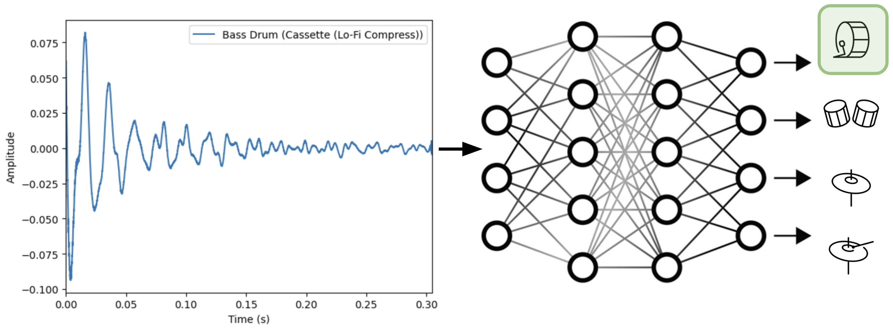
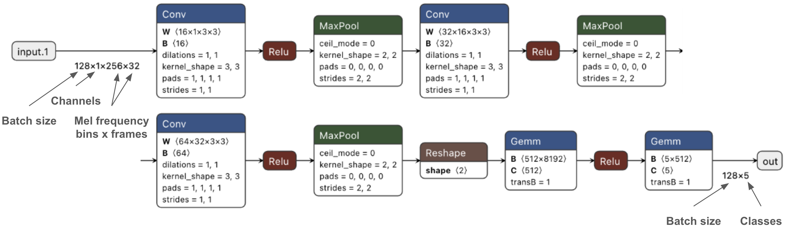
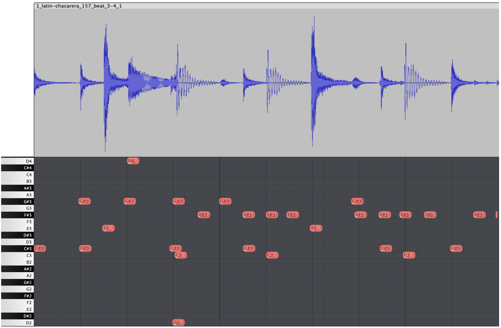
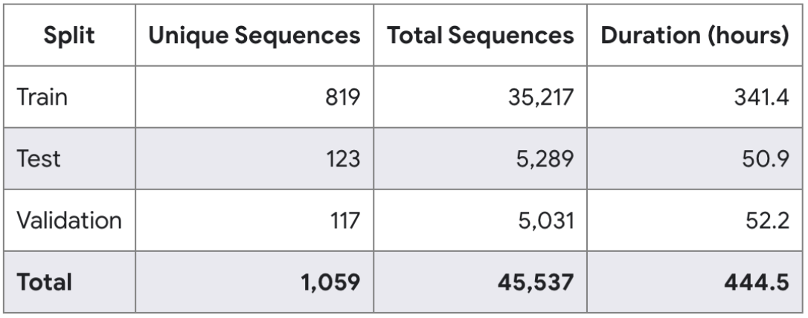
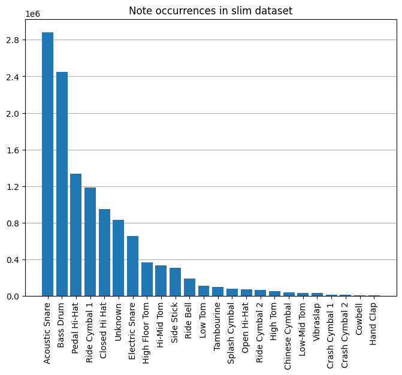
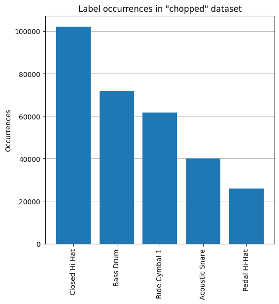

<div>



For my final project for Computational Data Analysis at Georgia Tech in Fall 2023, I created a drum classification model in PyTorch, trained on Magenta's [Expanded Groove MIDI Dataset (E-GMD)](https://magenta.tensorflow.org/datasets/e-gmd).

- [GitHub](https://github.com/khiner/DrumClassification) (includes model and training code, pretrained model and inference code, and dataset processing scripts)
- [Paper](https://github.com/khiner/DrumClassification/blob/main/Report.pdf)
- [Slide deck](https://docs.google.com/presentation/d/1ufFL36nH9eNNpiOiuhE9WII_oXde6DfoOEaypKhZuWA/edit#slide=id.p)
- [Dataset explorer notebook](https://github.com/khiner/DrumClassification/blob/main/explore_dataset.ipynb)

This course focused on the mathematical foundations of Probably Approximately Correct (PAC) learning and several machine learning algorithms, so I heavily favored model simplicity over classification accuracy.
Still, the model is no slouch with 93.4% accuracy over a far-from-perfect dataset and a [straightforward model and preprocessing pipeline](https://github.com/khiner/DrumClassification/blob/main/model.py) (no novel methods here!):



Still, the model is no slouch with 93.4% accuracy over a far-from-perfect dataset!

The distribution of misclassified samples shown in the confusion matrix below (with actual labels on the left and predicted labels on the bottom) largely reflects perceptual similarity.
For example, the model is least likely to mispredict a pedal hi-hat (a short burst of high-frequency metallic noise) as a bass drum (close to a smoothly decaying low-frequency sinusoid), and it is most likely to mispredict a closed hi-hat (struck with a stick) as a pedal hi-hat (sounded when closing the hit-hat with a pedal).
These failure modes are even more forgivable when considering each drum instrument class contains samples from a diverse range of drum kits.

<Image
  src="./assets/confusion_matrix.png"
  alt="Confusion matrix of drum classification model"
  style={{ maxWidth: 700 }}
/>

#### Chopped dataset of single-hit segments:

As usual, most of the work in this project was in the data preprocessing.
Magenta's E-GMD dataset consists of 444 hours of MIDI-annotated audio recordings of live drum sessions on a Roland TD-17 electronic drum kit, with 1,059 unique sequences recorded on 43 different drumkits each.

<div style={{
        display: 'flex',
        flexWrap: 'wrap',
        gap: '10px',
        justifyContent: 'center',
        alignItems: 'center',
        marginBottom: '1em',
      }}>

<div style={{ minWidth: 'min(450px, 100%)', flex: '1 1 50%', textAlign: 'center' }}>



<label>
  <small>{'MIDI-annotated audio recording of a single sequence'}</small>
</label>

</div>

<div style={{ minWidth: 'min(300px, 100%)', maxWidth: 450, flex: '1 1 35%', textAlign: 'center' }}>



<label>
  <small>{'Distribution of sequences in E-GMD'}</small>
</label>

</div>

</div>

First, I [slim the dataset](https://github.com/khiner/DrumClassification/blob/main/create_slim_metadata.py#L14-L25) to exclude all sessions belonging to 6 (out of 43) unconventional-sounding kits.
The remaining 37 kits range from completely synthetic (808/909, Nu RNB, ...) to acoustic (jazz, speed metal, 60s, ...):

```shell
$ python create_slim_metadata.py
Found 43 unique kits:
{'Nu RNB', 'Raw Dnb (Layered Hybrid)', 'Dark Hybrid', 'Fat Rock (Power Toms)', 'Pop-Rock (Studio)', 'Bigga Bop (Jazz)', 'Tight Prog', 'Live Rock', 'Heavy Metal', 'Studio (Live Room)', 'Big Room (Layered)', 'Alternative (Rock)', 'Classic Rock', 'Custom3', 'Super Boom (Layered)', 'JingleStacks (2nd Hi-Hat)', 'Acoustic Kit', 'Shuffle (Blues)', 'Arena Stage', 'Ele-Drum', 'Second Line', 'ClassicMetal (80s-90s)', 'Jazz Funk', 'Custom1', 'Alternative (METAL)', 'Dry & Heavy (Folk Rock)', 'Deep Daft', 'Rockin Gate (80s)', 'Warmer Funk', 'Unplugged', '60s Rock', '909 Simple', 'Speed Metal', 'Compact Lite (w/ Tambourine HH)', 'Funk Rock', 'More Cowbell (Pop-Rock)', 'Live Fusion', 'Cassette (Lo-Fi Compress)', 'Custom2', 'Modern Funk', 'Jazz', 'West Coast (FUNK)', '808 Simple'}
Keeping 37 kits:
{'Nu RNB', 'Fat Rock (Power Toms)', 'Dark Hybrid', 'Pop-Rock (Studio)', 'Bigga Bop (Jazz)', 'Tight Prog', 'Raw Dnb (Layered Hybrid)', 'Live Rock', 'Heavy Metal', 'Studio (Live Room)', 'Big Room (Layered)', 'Alternative (Rock)', 'Classic Rock', 'Super Boom (Layered)', 'JingleStacks (2nd Hi-Hat)', 'Acoustic Kit', 'Shuffle (Blues)', 'Arena Stage', 'Second Line', 'ClassicMetal (80s-90s)', 'Jazz Funk', 'Alternative (METAL)', 'Dry & Heavy (Folk Rock)', 'Rockin Gate (80s)', 'Warmer Funk', 'Unplugged', '60s Rock', '909 Simple', 'Speed Metal', 'Funk Rock', 'Live Fusion', 'More Cowbell (Pop-Rock)', 'Cassette (Lo-Fi Compress)', 'Modern Funk', 'Jazz', 'West Coast (FUNK)', '808 Simple'}
Excluding 6 kits:
{'Custom3', 'Custom1', 'Deep Daft', 'Custom2', 'Compact Lite (w/ Tambourine HH)', 'Ele-Drum'}

Saving slimmed dataset of 39183 rows to dataset/e-gmd-v1.0.0-slim.csv.
Excluded 6354 of 45537 rows.
```

{<p>To simplify the model and analysis, I decided not to attempt multi-way classification of overlapping drum instrument hits, so I used simple heuristics to process the MIDI and audio to find audio segments containing only a single, hopefully complete, drum instrument sound{" "}<small>(detailed in section 3.1 of{" "}<Link href="https://github.com/khiner/DrumClassification/blob/main/Report.pdf">the paper</Link> and implemented in the scripts described in the{" "}<Link href="https://github.com/khiner/DrumClassification/blob/main/README.md#prepare-data-for-training"><i>Prepare Data for Training</i></Link>{" "}section of the Readme).</small>{" "}
The resulting "chopped" dataset links to 301,640 regions of audio in the slimmed E-GMD matching the single-hit heuristics.
It contains many poorly segmented samples, including overlapping hits, missing or delayed onsets, and a rare mislabelled sample.
Poor segmentation is primarily due to the drum MIDI data only providing <i>onset</i>{" "}times, with the corresponding drum hit extending over an unknown duration.
The drum instrument classes are also highly unbalanced, as shown in the distribution of unique MIDI events per drum instrument in the slim dataset, and the top-5 most frequent chopped drum hits:</p>}

<div style={{
        display: 'flex',
        flexWrap: 'wrap',
        gap: '10px',
        justifyContent: 'space-between',
        alignItems: 'center',
        marginBottom: '1em',
      }}>





</div>

The dataset also includes several sessions with MIDI events misaligned from the audio clips a good bit more than the advertised 2ms alignment accuracy.
Even so, there are gains to be made by improving the heuristics for finding clean single-instrument hits.

#### Future work

If your goal is to achieve good classification performance, a more sane approach would be to download a variety of pre-labelled and well-segmented drum sample packs.
However, the MIDI-annotated audio dataset used here is more representative of real-world drum performances, which opens up many learning possibilities, including incorporating velocity information into a classification model, learning drum humanization models for MIDI, or even for generative drum synthesis (MIDI2Audio) models.
A big thank you to the Magenta team for putting in all the hard work to create the fantastic E-GMD dataset!
For more details, see the GitHub, paper, dataset explorer notebook, and slide deck.

</div>
