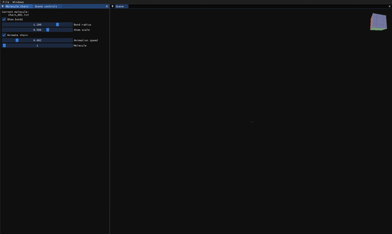

[GeoLDMViz](https://github.com/khiner/GeoLDMViz) is an interactive 3D visualizer for molecule chains generated by Geometric Latent Diffusion.

{
<i><Link href="https://www.youtube.com/watch?v=W7b-lYCAOLQ">Here is a short video</Link> showing vizualizer interaction.</i>
}

[GeoLDM](https://arxiv.org/pdf/2305.01140) (May 2023) was the first published effort to apply the Stable Diffusion paradigm of image generation to molecule generation.
It uses variational autoencoders (VAEs) to encode the atomic coordinates and features (e.g. atomic types and charges) of a molecule into a continuous latent space, and decodes these latent codes back into the molecule data domain.
Both the encoder and decoder are both parameterized with [Equivarient Graph Neural Networks](https://arxiv.org/abs/2102.09844) (EGNNs) to enforce rotational and translational equivariance in 3D space (the learned likelihoods are SE(3)-invariant, where SE(3) is the Special Euclidean group of rotation and translation in 3D space).

The visualizer application is agnostic to these model details.
It simply loads any folder of [XYZ files](https://en.wikipedia.org/wiki/Chemical_file_format#XYZ) and animates the contained molecule atomic types and coordinates.
I generated the molecule chain animated above by dowloading GeoLDM's published [pretrained models](https://drive.google.com/drive/folders/1EQ9koVx-GA98kaKBS8MZ_jJ8g4YhdKsL?usp=sharing) and sampling from the model trained on the [QM9 dataset](http://quantum-machine.org/datasets/).
(I had to make small modifications to the model code to run inference on my Mac using MPS - details are in [my fork](https://github.com/khiner/GeoLDM/blob/mps/RunMps.md)).

Molecules are rendered using OpenGL 3, embedded in a docked ImGui window.
It uses a simple [Phong shading model](https://github.com/khiner/GeoLDMViz/blob/main/res/shaders/fragment.glsl), with instanced spheres and cylinders for atoms and bonds.
Bond presence is determined by [pairwise distance thresholds](https://github.com/khiner/GeoLDMViz/blob/main/src/DatasetConfig.h) between atoms.

