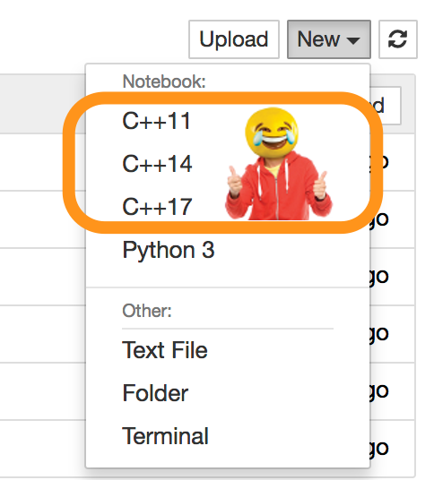

<div>

[_Accelerated C++_](https://www.amazon.com/Accelerated-C-Practical-Programming-Example/dp/020170353X/) comes up on a ton of "best books to learn C++" lists.
It was written before C++11, so it only covers core features.
I hesitated to start with it for fear of learning bad habits, but settled on reading this for "core C++" (C++98) knowledge, and supplementing with [Effective Modern C++](https://www.amazon.com/Effective-Modern-Specific-Ways-Improve/dp/1491903996) after learning the foundations.
I'm actually really happy with this approach, since I found that all "modern C++" (C++11/14/17) features crucially hinge on having a firm understanding of the core language features they build on and extend.
It's hard for me to imagine a non-overwhelming way of teaching/learning modern C++, in all its glory, without frequent reference to the outdated alternatives.
C++, backwards-compatible Frankenstein that it is, keeps these outdated pieces of itself close by at all times - all new features are in reference to, syntactic sugar for, analogous to, supersets of, tiptoeing around, implemented with, defined by ... old C++ features.
If you're completely new to (or completely rusty with) C++, I can recommend separating your learning into "old" and "new" sections.

## Book review

{<p>The book itself is well written and very well structured, with few mistakes.
It takes a well-honed and well-argued teaching approach of building things right off the bat using powerful standard library features, and elucidating details as-needed.
It does this without glossing over important details and without avoiding complexity where it lies.
It builds around two main example applications: ASCII "character pictures" (making framed triangles with stars - that sort of thing), and a student-grading application.
The former is a fun and eluminating project, but the latter is, in my opinion, excrutiating.
I don't know why so many introductory language resources and schools use this example.
I had to do these student grading command-line applications in college, too, and it was no less painful this time through.
Here are my two main issues with it:<ol><li>{" "}It doesn't motivate tasks.
Since the only intrinsic requirement of the problem is that data be input and output, once the basic IO is covered the only tasks are of the form,{" "}<i>"Let's say we wanted to display grades ..."</i> (alphabetically by last name, as a ratio of the average grade, on a curve, median grades, tabulated with student name followed by letter, etc.).</li><li>Grades have got to be the worst, most arbitrary, boring, even unpleasant thing about school.
Even financial aid is more interesting.
Who wants to think about grades all day long?</li></ol>Problem domain aside, I really enjoyed this book's tone, tempo and teaching philosophy.
The authors say it is the result of many years of tweaking and adapting the teaching of C++ to large groups of students, and it shows.
The tools you build up throughout the book are pretty generic and powerful.
I'll show an example in a bit.</p>}

## The Jupyter notebook

{<p><Link href="https://colab.research.google.com/github/khiner/notebooks/blob/master/accelerated_c++/index.ipynb"><big>This Jupyter notebook</big></Link>{" "}<small>(<Link href="https://github.com/khiner/notebooks/tree/master/accelerated_c++/">raw GitHub link</Link>)</small>{" "}contains all code and exercises for the book.
Where it makes sense, I implement the solutions inline in the notebook.
I couldn't really find any comprehensive solution sets or guides that cover every chapter of the book, so I hope people working through it find this and get use out of it!</p>}

## Wait, C++ in Jupyter?!

Heck yeah!
Well, kind of... it's a little clunky as of now.
More on that later.
For now, let's focus on the good:

<div style={{ display: 'flex', flexDirection: 'row' }}>

<div style={{ width: '50%' }}>

## C++ in Jupyter: The Good

The fact that you can run C++ at all with an interactive interpretter in the browser is really an amazing thing.
Being able to select whatever C++ version I want from Jupyter tickles me to no end.

The following is an example from the last chapter of the book.
It may not look like much, but it uses pretty much _only_ classes and types built up throughout the book.
The `Str` class is build from scratch to emulate `std::string`, and `Vec` is a hand-build container with sane support for most of the operations of `std::vector`. `Vec` even uses a custom reference-counting sort of proto-smart-pointer (similar to `std::auto_ptr`) under the hood!

</div>



</div>

```cpp
Picture histogram(const Vec<Student_info>& students) {
    Picture names;
    Picture grades;
    Picture spaces;

    for (Vec<Student_info>::const_iterator it = students.begin(); it < students.end(); ++it) {
        Vec<Str> names_vec = split(it->name());
        *(names_vec.end() - 1) += " ";
        names = vcat(names, names_vec);
        grades = vcat(grades, split(Str(it->grade() / 5, '=')));
    }

    return hcat(names, grades);
}
```

```cpp
std::ifstream student_file("../chapter_13/all_student_types_test_data.txt");
Vec<Student_info> students;
Student_info s;
while (s.read(student_file)) {
    students.push_back(s);
}

std::sort(students.begin(), students.end(), Student_info::compare);

std::cout << frame(histogram(students)) << std::endl;
```

```shell
****************************
*                          *
* GradMan ==============   *
* Hank    ========         *
* Karl    ================ *
* Quentin ===============  *
* Tina                     *
*                          *
****************************
```

This should feel homely for those who use Jupyter for Python a lot.
When it all works, it feels a lot like a Python notebook.
Pretty sweet.
However ...

## C++ in Jupyter: The Bad

After reading [this post](https://blog.jupyter.org/interactive-workflows-for-c-with-jupyter-fe9b54227d92) on the Jupyter blog, my expectations were much higher than what I actually found.
I [installed the cling kernelspecs directly](https://github.com/root-project/cling/tree/master/tools/Jupyter) instead of using the [Xeus Cling](https://github.com/QuantStack/xeus-cling) kernel, since Xeus is currently only available for the [Anaconda environment](https://www.anaconda.com/), which I don't use.
Based on their demo gifs and their comparatively active Github, it looks like the Xeus version may not have as many problems as the pure `cling` C++ kernels I tried.

{<p>The issues I ran into were pretty major:<ul><li>More than one <code>#include</code> in the same cell would result in nasty{" "}<code>function definition not allowed here</code> errors.</li><li>Ditto for multiple <code>using</code> declarations in the same cell.</li><li><p>I could not run any cell with declarations more than once in the same session.
I had to "restart and run all cells" every time I made a change, otherwise it would try redeclaring the functions/variables (scope seems to be shared globally and permanently until a kernel restart).</p><p>Of course, same-scope redefinitions are allowed in Python and not in C++, but much of the value of Jupyter is in changing and re-running individual cells until you get it right.
The behavior I would want is for cell re-execution to basically act like the previous cell run had never happened.</p></li><li>Standard input (<code>cin</code>) does not actually allow user input like it does in a Python Jupyter kernel, where if you run an <code>input</code> call, Jupyter nicely creates an HTML input prompt and passes the result back to the variable (which is so cool).
Instead, in the C++ kernels I tried it just moves on with no prompt, and <code>cin</code> returns as if it only received <code>EOF</code>.</li><li>Each cell has a little overhead to get started.
It makes the process a bit slow.
Not majorly slow, but with more than about 20 cells it feels like waiting for a long compile.</li></ul>If anyone has had better luck (say with Xeus) I'd be very curious to hear.
I'll probably try it with a fresh Conda install next time I'm in need of "interpretted" C++ in the browser.</p>}

## C++ in Jupyter: The Ugly

Here are a couple examples of the hackery I used to get around the above issues:

### Separate `#include`s, definition links and `using` declarations into separate cells

```cpp
#include <iostream>
```

```cpp
#include <fstream>
```

```cpp
#include "../chapter_14/Str.h"
```

```cpp
.L ../chapter_14/Student_info.cpp
```

```cpp
.L ../chapter_15/split.cpp
```

```cpp
.L ../chapter_4/median.cpp
```

### Use file IO instead of `cin`

{<><i><strong>Instead of</strong></i></>}

```cpp
Vec<Student_info> students;
Student_info s;
while (s.read(std::cin)) {
    students.push_back(s);
}
...
```

{<><i><strong>Do something like</strong></i></>}

```cpp
std::ifstream student_file("../chapter_13/all_student_types_test_data.txt");
Vec<Student_info> students;
Student_info s;
while (s.read(student_file)) {
    students.push_back(s);
}
...
```

## The future looks good

We're still in the Wild West phase with these tools, but the powers that be clearly have some interest in bringing pleasant workflow tools into the realm of the infamously unpleasant C++ environment.
I'm excited to see what the future brings here.
If C++ was even close to as easy to run in Jupyter as Python is, it could be an ideal way to link Python prototyping and efficient C++ implementations in the same place (not to mention other languages).
For a domain like DSP, this sounds like a pretty ideal setup.
If you've found a good way of integrating C++ and Python in Jupyter, I'd love to hear from you!

</div>
