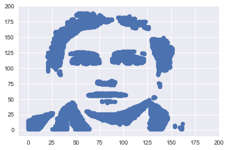
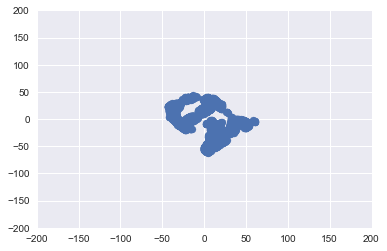
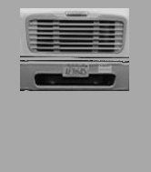

import three_approaches from './assets/coding_the_matrix/three_approaches_to_lin_alg.gif'

<div>

{<p><Link href="http://codingthematrix.com/"><i>Coding the Matrix</i></Link>{" "}seems to have a good reputation as a "computer science approach" to Linear Algebra.
It's popular and mostly well reviewed on Amazon, and is frequently recommended on QA sites.
I made a set of{" "}<Link href="https://colab.research.google.com/github/khiner/notebooks/blob/master/coding_the_matrix/index.ipynb">Jupyter notebooks</Link>{" "}<small>(<Link href="https://github.com/khiner/notebooks/tree/master/coding_the_matrix">raw Github link</Link>)</small>{" "}for every problem, lab and code example in the book.
It has formatted redefinitions of each problem, review question and lab statement, along with solutions, and should function as a decent solution manual for anyone working through the book.</p>}

## Many paths to understanding linear algebra

{<p>As demonstrated in{" "}<Link href="https://youtu.be/fNk_zzaMoSs">this incredible introduction to vectors by 3Blue1Brown</Link>,<Image src={three_approaches} alt="Three approaches to linear algebra from 3Blue1Brown" />linear algebra is framed in at least three major perspectives - the physics, math and computer science perspectives.
They each view the subject through distinct (but complementary and fundamentally equivalent) lenses.
They each have strong supporters and some detractors.</p>}

{<p>The mathematician and the computer scientist seem to butt heads the most.
Mathematicians argue for the value of generalization and context-invariant representation, while the CS gang focuses on practically computable solutions to discrete numerical problems.
For example, the best selling{" "}<Link href="https://www.amazon.com/Linear-Algebra-Right-Undergraduate-Mathematics/dp/3319110799">Linear Algebra Done Right</Link>, whose title is itself a tongue-in-cheek reference to this factionalism, takes the "pure-math" perspective with pride, boasting that its "novel approach banishes determinants to the end of the book" on the second line of its Amazon plug.<sup><a href="#aside_1">1</a></sup></p>}

## The <small>(mostly)</small> Computer Science Approach™

_Coding the Matrix_ seems to be the common recommendation for any computer science student looking to brush up on linear algebra in preparation for hands-on work in applied statistics and machine learning.

On the surface, it's true that the book doubles down on the computer science approach - almost every major concept discussed is ultimately implemented and explained by the author, or its implementation is assigned in a lab or exercise.
If you supplement the reading with the author's [Brown University lectures](https://cs.brown.edu/video/channels/coding-matrix-fall-2014/), you'll hear him say repeatedly that he adopts this approach, in part, because implementing the ideas helps students _own_ the material.
That is something I can always get behind, and this book does that well.
I feel much more ownership over these concepts than I did before reading it.

What surprised me about this book, however, is how far it turned out to lean towards *The Pure Mathematics Approach*™!

- The matrix and vector implementations built up early on in the book (partly as exercises), and used throughout the course, require explicit domains.
  (A numerical domain is never assumed in the code, and rarely in the text, even when it would be more convenient.)
- Matrix and vector operations are treated as function mappings that sometimes have integers as their domain, and rarely, if ever, as "lists of numbers".
- The contents of the book are no more conceptually dense than any undergrad linear algebra course.
  However, it is proof-heavy in the extreme.
  This is good for depth if you have the patience and time to dig into the proofs enough to really grok them.
  But there is very little hand holding along the path to understanding.
  I think the book could benefit from more focus on high-level intuition to supplement the proofs.
  In some chapters, the material is largely a series of proofs with a sentence or two before each proof as introduction.
- Just like Linear Algebra Done Wrong, determinants are also banished here to the end of the book.
  In fact, determinants are not even mentioned in the Brown University lectures, and in the book they are relegated to the position of "helpful in mathematical arguments, but turn out to be rarely useful in matrix computations".
  So the mathematicians and computer scientists both seem to agree that determinants are only worth a side-eyed sneer, but the mathematician thinks so because they're conceptually bulky and arguably not fundamental, and the computer scientist simply has no use for them.<sup><a href="#aside_2">2</a></sup>

If I were to summarize the most "shut-up-and-calculate" kind of lesson from this book, it would be to pretend, where possible, that matrix inversions don't exist.
They are slow to compute, and there always seems to be a clever way to work around actually computing the inverse of a matrix.
In _Coding the Matrix_, inversions are used only mathematically in proofs.
If one is needed in an assignment, it is formulated as an exact or approximate solution to a matrix-vector equation instead.

Overall, I think this book is offers a lot for the programming-inclined looking to get their hands dirty on a well-guided tour through a variety of domains.
No single book can represent all the useful ways of understanding this immense subject.
Linear algebra is a field that rewards (and arguably requires) _relearning in several different ways_ in order to solidify understanding.
I will continue learning about it from different angles.

## Greatest hits

The following is a selection of some notable example material selected from each chapter's notebook.
I offer no explanations here, and provide these as a selection of the material covered in the book.
For a full understanding of what's going on in these examples, the book is your resource.

### [Chapter 0](https://colab.research.google.com/github/khiner/notebooks/blob/master/coding_the_matrix/chapter_0/chapter_0.ipynb)

{<>(Just introduces Python.)</>}

### [Chapter 1](https://colab.research.google.com/github/khiner/notebooks/blob/master/coding_the_matrix/chapter_1/chapter_1.ipynb)

```python
pts = [(x + 1j * (len(data) - y)) for (y, row) in enumerate(data) for (x, intensity) in enumerate(row) if np.mean(intensity) < 120]
plot_complex_points(pts, xlim=(-10, 200), ylim=(-10, 200))
```



**Task 1.4.20:** Write a comprehension that transforms the set pts by translating it so the image is centered, then rotating it by $π / 4$, then scaling it by half.
Plot the result.

```python
plot_complex_points([rotate(z, pi/4) / 2 for z in translate_to_origin(pts)], xlim=(-200, 200), ylim=(-200, 200))
```



### [Chapter 2](https://colab.research.google.com/github/khiner/notebooks/blob/master/coding_the_matrix/chapter_2/chapter_2.ipynb)

### 2.12.5: Not your average Democrat

{<>{" "}</>}

**Task 2.12.7:** Write a procedure `find_average_similarity(sen, sen_set, voting_dict)` that, given the name `sen` of a senator, compares that senator's voting record to the voting records of all senators whose names are in `sen_set`, computing a dot-product for each, and then returns the average dot-product.

Use your procedure to compute which senator has the greatest average similarity with the set of Democrats (you can extract this set from the input file).

```python
def find_average_similarity(sen, sen_set, voting_dict):
    all_dot_products = [policy_compare(sen, other_sen, voting_dict) for other_sen in sen_set]
    return sum(all_dot_products) / len(all_dot_products)

senators_for_party = {}
for party in ['D', 'R']:
    senators_for_party[party] = [s.split()[0] for s in l if s.split()[1] == party]

average_similarity_with_dems_for_sen = {sen: find_average_similarity(sen, senators_for_party['D'], voting_dict) for sen in voting_dict.keys()}
max(average_similarity_with_dems_for_sen, key=average_similarity_with_dems_for_sen.get)
> 'Biden'
```

### [Chapter 3](https://colab.research.google.com/github/khiner/notebooks/blob/master/coding_the_matrix/chapter_3/chapter_3.ipynb)

**Problem 3.8.4:** Let $a, b$ be real numbers.
Consider the equation $z = ax + by$.
Prove that there are two 3-vectors $\\boldsymbol\{v\_1\}, \\boldsymbol\{v\_2\}$ such that the set of points $\[x, y, z\]$ satisfying the equation is exactly the set of linear combinations of $oldsymbol\{v\_1\}$ and $oldsymbol\{v\_2\}$.

Let's start by finding two linearly independent solutions to $ax + by = z$:

$1a + 0b = a$ $0a + 1b = b$

Thus, $\[1, 0, a\]$ and $\[0, 1, b\]$ are solutions.
Now, we will show that if $ax + by = z$, then there exists $\\delta, \\gamma \\in \\mathbb\{R\}$ such that $\[x, y, z\] = \\delta \[1, 0, a\] + \\gamma \[0, 1, b\] = \[\\delta, \\gamma, \\delta a + \\gamma b\]$:

If $ax + by = z$, then we can use basic algebra to find expressions for $x$, $y$ and $z$:

$x = \\frac\{z - by\}\{a\}, y = \\frac\{z - ax\}\{b\}, z = ax + by$

If we let $\\delta = x = \\frac\{z - by\}\{a\}$ and $\\gamma = y = \\frac\{z - ax\}\{b\}$, then$z = \\delta a + \\gamma b = (\\frac\{z - by\}\{a\}) a + (\\frac\{z - ax\}\{b\}) b = z - by + z - ax\\\\ =\> z = ax + by$QED

### [Chapter 4](https://colab.research.google.com/github/khiner/notebooks/blob/master/coding_the_matrix/chapter_4/chapter_4_with_lab_and_exercises.ipynb)

**Task 4.15.11:** Write a procedure `reflect_about(x1, y1, x2, y2)` that takes two points and returns the matrix that reflects about the line defined by the two points.

```python
def reflect_about(x1, y1, x2, y2):
    m = (y2 - y1) / (x2 - x1) if x2 - x1 != 0 else 1
    b = y1 - m * x1 theta = math.atan(m)
    return translation(0, b) * rotation(theta) * reflect_x() * rotation(-theta) * translation(0, -b)

print(reflect_about(2, 2, 3, 1) * Vec({'x', 'y', 'u'}, {'x': 1, 'y': 1, 'u': 1}))

 u x y
------
 1 3 3
```

```python
mat2display(reflect_about(0, 100, 256, 200) * mandelbrot_locations, mandelbrot_colors)
```

<Image src="./assets/coding_the_matrix/mandelbrot_rotated.png" style={{ maxWidth: 180 }} />

### [Chapter 5](https://colab.research.google.com/github/khiner/notebooks/blob/master/coding_the_matrix/chapter_5/chapter_5_with_lab.ipynb)

**Task 5.12.7:** Each column of `Y_pts` gives the whiteboard-coordinate representation $(y\_1, y\_2, y\_3)$ of a point $\\boldsymbol\{q\}$ in the image.
We need to construct another matrix `Y_board` in which each column gives the whiteboard-coordinate representation $(y\_1/y\_3,y\_2/y\_3,1)$ of the corresponding point $\\boldsymbol\{p\}$ in the plane containing the whiteboard.
Write a procedure `mat_move2board(Y)` with the following spec:

- input: a `Mat` each column of which is a vector giving the whiteboard coordinates of a point $\\boldsymbol\{q\}$
- output: a `Mat` each column of which is the corresponding point in the whiteboard plane (the point of intersection with the whiteboard plane of the line through the origin and $\\boldsymbol\{q\}$

Once your `mat_move2board` procedure is working, use it to derive the matrix `Y_board` from `Y_pts`:

```python
from matutil import mat2coldict, coldict2mat
def mat_move2board(Y_pts):
    coldict = mat2coldict(Y_pts)
    return coldict2mat({k: move2board(v) for k, v in coldict.items()})

  Y_board = mat_move2board(Y_pts)
```

{<><strong>Task 5.12.8:</strong> Finally, display the result of</>}

```python
image_mat_util.mat2display(Y_board, colors, ('y1', 'y2', 'y3'), scale=100, xmin=None, ymin=None)
```

<Image
  src="./assets/coding_the_matrix/board_transformed.png"
  style={{ maxWidth: 700 }}
  alt="Whiteboard with writing, taken from a skewed angle"
/>

{<><strong>Original image:</strong></>}

<Image
  src="./assets/coding_the_matrix/board.png"
  style={{ maxWidth: 600 }}
  alt="Whiteboard with writing, transformed to make the board a rectangle"
/>

### [Chapter 6](https://colab.research.google.com/github/khiner/notebooks/blob/master/coding_the_matrix/chapter_6/chapter_6.ipynb)

**Problem 6.7.12:** Write and test a procedure `is_invertible(M)` with the following spec:

- input: an instance `M` of `Mat`
- \_output: `True` if `M` is an invertible matrix, `False` otherwise

Your procedure should not use any loops or comprehensions.
It can use procedures from the `matutil` module and from the `independence` module.

Test your procedure with the following examples:

Over $\\mathbb\{R\}$:

$\\begin\{bmatrix\}1 &2 &3\\\\3 &1 &1\\end\{bmatrix\}$: False $\\begin\{bmatrix\}1 &0 &1 &0\\\\0 &2 &1 &0\\\\0 &0 &3 &1\\\\0 &0 &0 &4\\end\{bmatrix\}$: True $\\begin\{bmatrix\}1 &0\\\\0 &1\\\\2 &1\\end\{bmatrix\}$: False $\\begin\{bmatrix\}1 &0\\\\0 &1\\end\{bmatrix\}$: True $\\begin\{bmatrix\}1 &0 &1\\\\0 &1 &1\\\\1 &1 &0\\end\{bmatrix\}$: True

Over $GF(2)$:

$\\begin\{bmatrix\}one &0 &one\\\\0 &one &one\\\\one &one &0\\end\{bmatrix\}$: False $\\begin\{bmatrix\}one &one\\\\0 &one\\end\{bmatrix\}$: True

{<>Note the resemblance between two matrices, one over {"$\\mathbb{R}$"} and one over $GF(2)$, and note that one is invertible and the other is not.</>}

```python
from matutil import mat2coldict
from matutil import listlist2mat

def is_invertible(M):
    return M.is_square() and my_is_independent(list(mat2coldict(M).values()))

is_invertible(listlist2mat([[1,2,3],[3,1,1]]))
> False

is_invertible(listlist2mat([[1,0,1,0],[0,2,1,0],[0,0,3,1],[0,0,0,4]]))
> True

is_invertible(listlist2mat([[1,0],[0,1],[2,1]]))
> False
```

### [Chapter 7](https://colab.research.google.com/github/khiner/notebooks/blob/master/coding_the_matrix/chapter_7/chapter_7_labs.ipynb)

**Task 7.8.11:** Let $N = 2461799993978700679$, and try to factor $N$

- Let `primelist` be the set of primes up to 10,000.
- Use `find_candidates(N, primelist)` to compute the lists `roots` and `rowlist`.
- Use `echelon.transformation_rows(rowlist)` to get a matrix `M`.
- Let `v` be the last row of `M`, and find `a` and `b` using `find_a_and_b(v, roots, N)`.
- See if `a - b` has a nontrivial common divisor with `N`.
  If not, repeat with `v` being the second-to-last row of `M` or the third-to-last row...

Give a nontirvial divisor of $N$.

```python
def factor(N):
    primelist = primes(10_000)
    roots, rowlist = find_candidates(N, primelist)
    M = transformation_rows(rowlist, sorted(primelist, reverse=True))
    for v in reversed(M):
        a, b = find_a_and_b(v, roots, N)
        divisor = gcd(a - b, N)
        if divisor != 1 and divisor != N:
            return divisor

N=2461799993978700679
factor(N)
> 1230926561
```

### [Chapter 8](https://colab.research.google.com/github/khiner/notebooks/blob/master/coding_the_matrix/chapter_8/chapter_8.ipynb)

**Task 8.4.10:** Write a procedure `gradient_descent_step(A, b, w, sigma)` that, given the training data $A$, $\\boldsymbol\{b\}$ and the current hypothesis vector $\\boldsymbol\{w\}$, returns the next hypothesis vector.

The next hypothesis vector is obtained by computing the gradient, multiplying the gradient by the step size, and subtracting the result from the current hypothesis vector.

```python
def gradient_descent_step(A, b, w, sigma):
    return w - sigma * find_grad(A, b, w)
```

**Task 8.4.11:** Write a procedure `gradient_descent(A, b, w, sigma, T)` that takes as input the training data $A$, $\\boldsymbol\{b\}$, and initial value $\\boldsymbol\{w\}$ for the hypothesis vector, a step size $\\sigma$, and a number $T$ of iterations.
The procedure should implement gradient descent as described above for $T$ iterations, and return the final value of $\\boldsymbol\{w\}$.

Every thirty iterations or so, the procedure should print out the value of the loss function and the fraction wrong for the current hypothesis vector.

```python
def gradient_descent(A, b, w, sigma, T):
    for i in range(T):
        if i % 30 == 0:
            print('Loss:\t', loss(A, b, w))
            print('Fraction wrong:\t', fraction_wrong(A, b, w))
        w = gradient_descent_step(A, b, w, sigma)
    return w
```

**Task 8.4.12:** Try out your gradient descent code on the training data!
Notice that the fraction wrong might go up even while the value of the loss function goes down.
Eventually, as the value of the loss function continues to decrease, the fraction wrong should also decrease (up to a point).

Try a step size of $\\sigma = 10^\{-9\}$.

```python
w = Vec(A.D[1], {k: 1 for k in A.D[1]})
sigma = 1e-9 # sigma too large
T = 300
gradient_descent(A, b, w, sigma, T)

Loss:	 1461169191.1916513
Fraction wrong:	 0.5133333333333333
Loss:	 1867476.164994827
Fraction wrong:	 0.73
Loss:	 1501858.2431936574
Fraction wrong:	 0.7133333333333334
Loss:	 1261341.0368251363
Fraction wrong:	 0.7133333333333334
Loss:	 1099845.1036712618
Fraction wrong:	 0.7166666666666667
Loss:	 988408.6940531735
Fraction wrong:	 0.7133333333333334
Loss:	 908821.9038339362
Fraction wrong:	 0.71
Loss:	 849628.557730042
Fraction wrong:	 0.7166666666666667
Loss:	 803615.1441978435
Fraction wrong:	 0.7033333333333334
Loss:	 766233.6931558683
Fraction wrong:	 0.7066666666666667
```

### [Chapter 9](https://colab.research.google.com/github/khiner/notebooks/blob/master/coding_the_matrix/chapter_9/chapter_9.ipynb)

**Problem 9.11.9:** Write a module `orthonormalization` that defines a procedure `orthonormalize(L)` with the following spec:

- input: a list `L` of linearly independent `Vec`s
- output: a list `Lstar` of `len(L)` orthonormal `Vec`s such that, for `i = 1, ..., len(L)`, the first `i` `Vec`s of `Lstar` and the first `i` `Vec`s of `L` span the same space.

Your procedure should follow this outline:

1.  Call `orthogonalize(L)`
2.  Compute the list of norms of the resulting vectors, and
3.  Return the list resulting from normalizing each of the vectors resulting from Step 1.

```python
def orthonormalize(L):
    Lstar_not_normalized = orthogonalize(L)
    norms = [(Lstar_i * Lstar_i)**0.5 for Lstar_i in Lstar_not_normalized]
    return [Lstar_i / norm for Lstar_i, norm in zip(Lstar_not_normalized, norms)]

orthonormalize([list2vec([4,3,1,2]), list2vec([8,9,-5,-5]), list2vec([10,1,-1,5])])
> [Vec({0, 1, 2, 3},{0: 0.7302967433402214, 1: 0.5477225575051661, 2: 0.18257418583505536, 3: 0.3651483716701107}),
 Vec({0, 1, 2, 3},{0: 0.1867707814860146, 1: 0.4027244975792189, 2: -0.5661489313794816, 3: -0.6945538436511166}),
 Vec({0, 1, 2, 3},{0: 0.5275409009423367, 1: -0.6531216993058959, 2: -0.5123087286340884, 3: 0.18075511139121447})]
```

**Problem 9.11.10:** Write a procedure `aug_orthonormalize(L` in your `orthonormalization` module with the following spec:

<ul>

<li>
  {' '}
  <i>{'input:'}</i>
  {' a list '}
  <code>{'L'}</code>
  {' of '}
  <code>{'Vec'}</code>
  {'s'}
</li>

<li>

{<>{" "}<i>output:</i> a pair <code>Qlist, Rlist</code> of lists of <code>Vec</code>s such that</>}

- `coldict2mat(L)` equals `coldict2mat(Qlist)` times `coldict2mat(Rlist)`, and
- `Qlist = orthonormalize(L)`

</li>

</ul>

```python
from vec import Vec
from orthogonalization import aug_orthogonalize
from matutil import mat2coldict

def aug_orthonormalize(L):
    Qlist = orthonormalize(L)
    Q = coldict2mat(Qlist).transpose()
    R = Q * coldict2mat(L)
    Rlist = list(mat2coldict(R).values())
    return Qlist, Rlist

from matutil import coldict2mat

L = [list2vec(v) for v in [[4,3,1,2],[8,9,-5,-5],[10,1,-1,5]]]
Qlist, Rlist = aug_orthonormalize(L)
print(coldict2mat(Qlist))

           0      1      2
     ---------------------
 0  |   0.73  0.187  0.528
 1  |  0.548  0.403 -0.653
 2  |  0.183 -0.566 -0.512
 3  |  0.365 -0.695  0.181

print(coldict2mat(Rlist))

               0        1      2
     ---------------------------
 0  |       5.48     8.03   9.49
 1  |   2.22E-16     11.4 -0.636
 2  |  -2.22E-16 4.44E-16   6.04
print(coldict2mat(Qlist) * coldict2mat(Rlist))

       0  1  2
     ---------
 0  |  4  8 10
 1  |  3  9  1
 2  |  1 -5 -1
 3  |  2 -5  5
```

### [Chapter 10](https://colab.research.google.com/github/khiner/notebooks/blob/master/coding_the_matrix/chapter_10/chapter_10.ipynb)

**Task 10.9.18:** Finally, use `suppress2d(D_dict, threshold)` and `sparsity2d(D_dict)` to come up with a threshold that achieves the degree of compression you would like.
Apply the backward transform and round the result using `image_round`, and then view it to see how close it is to the original image.

```python
compressed = suppress2d(transformed, 20)
print('Compression rate: ', str(sparsity2d(compressed) * 100) + ' percent of original size')
positions, colors = image2mat(image_round(backward2d(compressed)))
mat2display(positions, colors)

Compression rate:  14.00299072265625 percent of original size
```

<Image src="./assets/coding_the_matrix/dali_compressed.png" style={{ maxWidth: 400 }} />

### [Chapter 11](https://colab.research.google.com/github/khiner/notebooks/blob/master/coding_the_matrix/chapter_11/chapter_11.ipynb)

**Task 11.6.7:** We will use the `distance_squared` procedure to classify images.
First let's consider the images we already know to be faces.
Compute the list consisting of their distances from the subspace of chosen eigenfaces (remember to work with the centered image vectors).
Why are these distances not zero?

```python
# based on wording of later questions, I'm actually going to compute the _squared_ distances from the subspace
centered_face_distances_squared = [distance_squared(V_10.transpose(), centered_face_images[i]) for i in range(len(centered_face_images))]
```

**Task 11.6.8:** Next, for each unclassified image vector, center the vector by subtracting the average face vector, and find the squared distance of the centered image vector from the subspace of eigenfaces you found in Problem 11.6.3.
Based on the distances you found, estimate which images are faces and which are not.

```python
unclassified_images = {i: image2vec(color2gray(file2image("unclassified/img%02d.png" % i))) for i in range(10)}
centered_unclassified_images = {i: unclassified_images[i] - a for i in range(len(unclassified_images))}
centered_unclassified_distances_squared = [distance_squared(V_10.transpose(), centered_unclassified_images[i]) for i in range(len(centered_unclassified_images))]

# Let's use as a threshold 2.5X the _max_ of the known squared face-vector distances. (I got this from trying a few different values.)
threshold_distance_squared = max(centered_face_distances_squared) * 2.5

is_face_estimate_mask = [distance_squared < threshold_distance_squared for distance_squared in centered_unclassified_distances_squared]
```

**Task 11.6.9:** Display each of the unclassified images to check your estimate.
Are the squared distances of non-faces indeed greater than those for faces?
What is the single threshold value you would choose to decide if a given image is a face or not?

<div style={{ display: 'flex' }}>

{<div style={{ margin: 'auto' }}>Predicted as face</div>}

{<div style={{ margin: 'auto' }}>Predicted as not-a-face</div>}

</div>

<div style={{ display: 'flex' }}>

<div style={{ margin: 'auto' }}>


</div>

<div style={{ margin: 'auto' }}>



</div>

</div>

<div style={{ display: 'flex' }}>

<div style={{ margin: 'auto' }}>


</div>

<div style={{ margin: 'auto' }}>


</div>

</div>

<div style={{ display: 'flex' }}>

<div style={{ margin: 'auto' }}>


</div>

<div style={{ margin: 'auto' }}>


</div>

</div>

<div style={{ display: 'flex' }}>

<div style={{ margin: 'auto' }}>


</div>

<div style={{ margin: 'auto' }}>


</div>

</div>

<div style={{ display: 'flex' }}>

<div style={{ margin: 'auto' }}>


</div>

<div style={{ margin: 'auto' }}>


</div>

</div>

### [Chapter 12](https://colab.research.google.com/github/khiner/notebooks/blob/master/coding_the_matrix/chapter_12/chapter_12.ipynb)

**Task 12.12.5:** Write a procedure `wikigoogle` with the following spec:

<ul>

<li>

{<>{" "}<i>input:</i></>}

- A single word `w`
- The number `k` of desired results
- The pagerank eigenvector `p`

</li>

<li>
  {' '}
  <i>{'output:'}</i>
  {' a list of the names of the '}
  <code>{'k'}</code>
  {' highest-pagerank wikipedia articles containing that word.'}
</li>

</ul>

```python
from pagerank import read_data, find_word

links = read_data()

Reading word meta-index
Reading titles
Reading link structure
..................................................................................
Done
```

```python
def wikigoogle(w, k, p):
    related = find_word(w)
    related.sort(key=lambda x: p[x], reverse=True)
    return related[:k]
```

**Task 12.12.6** Use `power_method` to compute the pagerank eigenvector for the wikipedia corpus and try some queries to see the titles of the top few pages: "jordan", "obama", "tiger" and of course "matrix".
What do you get for your top few articles?
Can you explain why?
Are the top ranked results more relevant or important in some sense than, say, the first few articles returned by `find_word` without ranking?

```python
from mat import Mat

A1 = make_Markov(links)
A2 = Mat(A1.D, {k:1/len(A1.D[0]) for k in A1.f.keys()})
A = 0.85*A1 + 0.15*A2

p = power_method(A, 6)

jordan_results = wikigoogle('jordan', 5, p)
obama_results  = wikigoogle('obama', 5, p)
tiger_results  = wikigoogle('tiger', 5, p)
matrix_results = wikigoogle('matrix', 5, p)

jordan_results
> ['2007', '2006', '2005', 'paris', 'israel']

obama_results
> ['united states',
 'president of the united states',
 'chicago',
 'democratic party (united states)',
 'illinois']
```

<div id="aside_1">

{<p><small><sup>1</sup> There is also a{" "}<Link href="http://www.math.brown.edu/~treil/papers/LADW/LADW.html"><i>Linear Algebra Done Wrong</i></Link>{" "}book whose name nudges good-naturedly at the aforementioned <i>"Done Right"</i>.</small></p>}

</div>

<div id="aside_2">

{<p><small><sup>2</sup> I remember determinants feeling unmotivated in my first class on linear algebra in college.
However,{" "}<Link href="https://www.youtube.com/playlist?list=PLZHQObOWTQDPD3MizzM2xVFitgF8hE_ab">3Blue1Brown's linear algebra series</Link>takes what might be considered a fourth path to understanding linear algebra, which could be called the "geometric intuition" path.
From this vantage point, determinants are the conceptual glue between projection, inversion, change-of-basis and eigenvalues.</small></p>}

</div>

</div>
