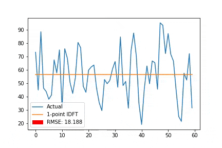
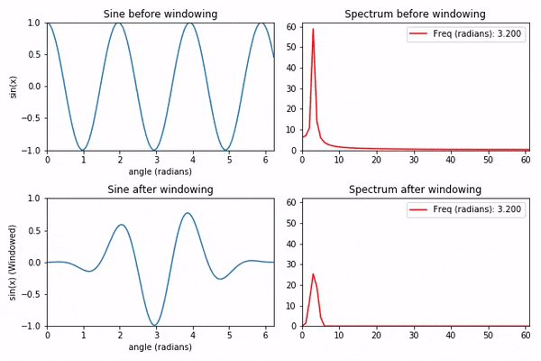
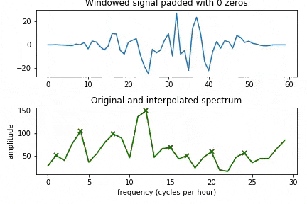

_Update: A newer post of mine, [Mathematics of the DFT](https://karlhiner.com/jupyter_notebooks/mathematics_of_the_dft), is a much more comprehensive look at the DFT._

[DFT for Timeseries Data](https://colab.research.google.com/github/khiner/notebooks/blob/master/dft-timeseries/DftTimeseries.ipynb) is a Jupyter Notebook I developed for a presentation on applying the DFT to timeseries data for seasonality detection.
The notebook attempts to build understanding one step at a time from a direct mathematical implementation and explanation of the DFT, to implementing frequency magnitude detection and approximate resynthesis.

{
<i><b>Note: </b>Being that this was designed to go along with a presentation, I would not recommend it as a first introduction to the DFT since it's really mostly code with some images for visual explanation.</i>{" "}
Armed with some knowledge of the DFT already, I think it should help clarify some behaviors visually and could serve an implementation reference for some algorithms.
I'm going to be digging into{" "}<Link href="https://www.amazon.com/Mathematics-Discrete-Fourier-Transform-DFT/dp/097456074X">Julius O. Smith's <i>Mathematics of the Discrete Fourier Transform</i></Link>{" "}soon, so there should be more DFT-related notebooks to come!
}

Here are some of the animations built up in this notebook:

<ul>

<li>

_Increasing the number of DFT points results in better reconstruction of the original series:_

</li>

<li>

_The effects of windowing a pure sinusoid when the window is not an exact multiple of the period:_

</li>

<li>

_The effect of window size on frequency magnitude accuracy:_

</li>

</ul>

