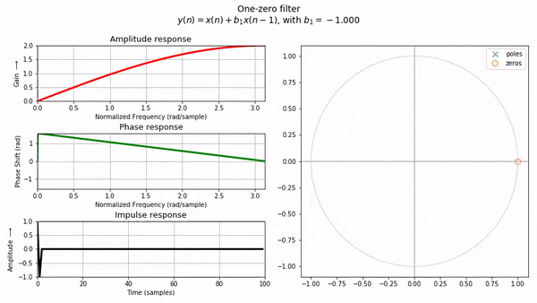
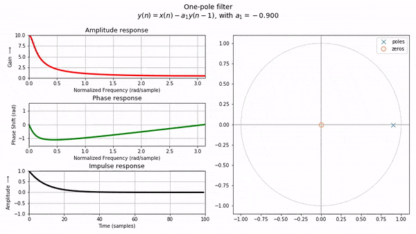
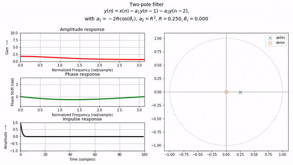
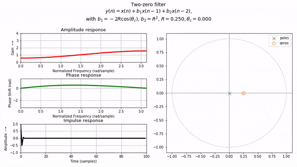
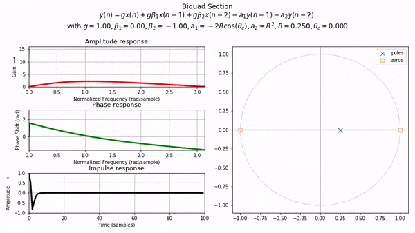
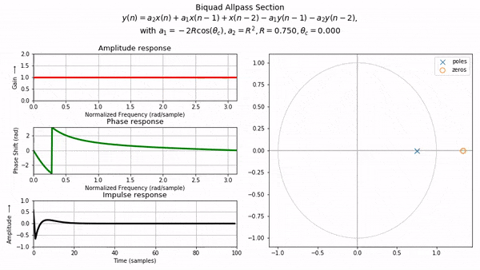
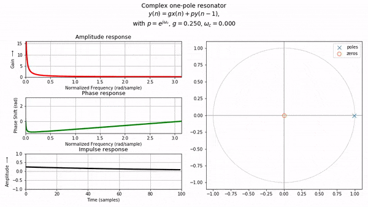
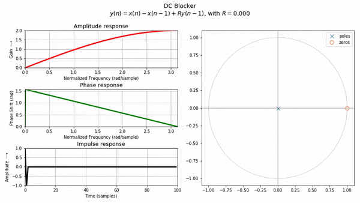

<div>

{<p><Link href="https://colab.research.google.com/github/khiner/notebooks/blob/master/introduction_to_digital_filters/index.ipynb">This set of Jupyter notebooks</Link>{" "}<small>(<Link href="https://github.com/khiner/notebooks/blob/master/introduction_to_digital_filters/">raw Github link</Link>)</small>{" "}covers the second book in Julius O. Smith III's excellent four-book series on audio DSP,{" "}<Link href="https://www.amazon.com/Introduction-Digital-Filters-Audio-Applications/dp/0974560715/">Introduction to Digital Filters: with Audio Applications</Link>.
This book takes the concepts from{" "}<Link href="https://karlhiner.com/jupyter_notebooks/mathematics_of_the_dft">Mathematics of the DFT</Link> and runs with it, getting deep into digital filter theory, analysis, design and applications.</p>}

The difficulty level goes up quite a bit here - lots of complex analysis tricks are used to derive results and a substantial amount of algebraic manipulation and creativity in the complex domain is used throughout the book, and required to solve the exercises.

### Analytic vs graphical approaches to understanding filters

Readers of this blog will know that I love visualizations.
In this domain, I especially found that visually exploring the concepts really helped to develop my intuition.
It's easy to get bogged down trying to derive exact analytic solutions for a filter's response.
I spent many maddening/rewarding hours desperately trying random trig identities for half a page to try and get some closed solution, only to find at the end that it could have been done in a few steps by using some complex algebra trick.

However, when you step away from the symbolic and analytic approach and just start moving the poles and zeros of a filter around and seeing what happens, the intimidation wears off a bit and it starts to feel within the realm of possibility to maybe actually _design_ a filter response using some pretty intuitive visual reasoning.

## Designing a second-order filter to reject 60 Hz hum

{<p>For example, say we want to design a filter (as we are asked to do in{" "}<Link href="https://colab.research.google.com/github/khiner/notebooks/blob/master/introduction_to_digital_filters/chapter_8_pole_zero_analysis.ipynb#Pole-Zero-Analysis-Problems">the first exercise of Chapter 8</Link>) to attenuate 60 Hz hum, given a sampling rate of 40 KHz.
I will walk through my more analytic attempt at the problem, and then I'll give a visual explanation of a more canonical notch filter that cuts past a lot of analytic hair-pulling.
If you'd like you can also just <a href="#graphical">skip to the graphical approach</a>.</p>}

### An analytic approach

{<p><small><i>Note: For brevity I'm going to assume some notational and terminology knowledge in this section.
In the next section, I will back up and explain things more fully :)</i></small></p>}

We want our filter to have a zero at 60 Hz.
For now, let's consider only FIR filters (with no feedback component).
We are given the constraint that the filter must be second-order.
The factored form of a second-order FIR filter is

$H(z) = B(z) = (1 - q\_1z^\{-1\})(1 - q\_2z^\{-1\}) = 1 - (q\_1 + q\_2)z^\{-1\} + q\_1q\_2z^\{-2\}$,

where $q\_1$ and $q\_2$ are the zeros of the frequency response.
If we want the amplitude response to equal zero at normalized frequencies $\\omega\_\{r1\}$ and $\\omega\_\{r2\}$, we can simply choose complex filter coefficients such that $\\frac\{q\_i\}\{z\} = 1$ when $z = e^\{j\\omega\_\{ri\}\} \\implies q\_i = e^\{j\\omega\_\{ri\}\}$.

Here is an example for clarity:

```python
from scipy.signal import freqz

# Pick a couple of arbitrary frequencies to reject.
w1_reject = 0.8
w2_reject = 2.2

N = 512
q1 = np.exp(1j * w1_reject)
q2 = np.exp(1j * w2_reject)

B = [1, -(q1 + q2), q1 * q2]; A = [1]
w, h = freqz(B, A, worN = N)
plt.plot(w, np.abs(h))
for w_reject in [w1_reject, w2_reject]:
    plt.axvline(x=w_reject, linestyle='--', c='k')
plt.grid(True)
```

<Image
  src="./assets/intro_to_digital_filters/second_order_response.png"
  alt="frequency response of second-order filter rejecting two hand-picked frequencies"
  style={{ maxWidth: '550px' }}
/>

We could technically be done here since the problem doesn't stipulate any more constraints, nor does it stipulate how wide the passband should be.
However, I don't think this is what the question is after.

If we want a second-order FIR filter with a _real_ coefficient $b\_1$ (and $b\_2 = 1$), such that the amplitude response is equal to $0$ for normalized frequency $\\omega,$ we set the amplitude response to $0$ and solve for $b\_1$:

$\\begin\{align\} G(\\omega) = \\left|H(e^\{j\\omega T\})\\right| &= \\left|1 + b\_1e^\{-j\\omega T\} + e^\{-j2\\omega T\}\\right|\\\\ 0 &= \\left|e^\{j2\\omega T\} + b\_1e^\{j\\omega T\} + 1\\right|\\\\ \\end\{align\}$

The only way for the magnitude of a complex number to be $0$ is if the complex number itself is $0$.
I know it's obvious but I needed to think about this for a while and found out the hard way that this works cleanly after solving with trig by expanding using Euler's identity.
Here's a much simpler way:

$\\begin\{align\} 0 &= e^\{j2\\omega T\} + b\_1e^\{j\\omega T\} + 1\\\\ -e^\{j2\\omega T\} - 1 &= b\_1e^\{j\\omega T\}\\\\ -\\frac\{e^\{j2\\omega T\} + 1\}\{e^\{j\\omega T\}\} &= b\_1\\\\ -(e^\{j\\omega T\} + e^\{-j\\omega T\}) &= b\_1\\\\ -2\\cos(\\omega T) &= b\_1\\\\ \\end\{align\}$

We are given the sampling interval $T = \\frac\{1\}\{f\_s\} = \\frac\{1\}\{40k\} s$.

When $f = 60 Hz$,

$\\begin\{align\} b\_1 &= -2\\cos(\\omega T)\\\\ &= -2\\cos\\left(2\\pi \\frac\{60\}\{40k\}\\right)\\\\ &= -2\\cos\\left(\\frac\{3\\pi\}\{1000\}\\right)\\\\ \\end\{align\}$

Finally, our naive second-order 60 Hz hum-reject-filter for a sampling rate of $f\_s=40$ Khz is

$y(n) = x(n) - 2\\cos\\left(\\frac\{3\\pi\}\{1000\}\\right)x(n-1) + x(n-2)$.

```python
fs = 40_000
B = [1, -2*np.cos(3 * np.pi / 1000), 1]
H = np.fft.fft(B, n=fs)
f = np.arange(0, fs // 2)

plt.axvline(x=60, linestyle='--', c='k', label='Target reject frequency (60 Hz)')
plt.loglog(f, np.abs(H[:fs//2]))
plt.legend()
plt.grid(True)
```

<Image
  src="./assets/intro_to_digital_filters/60_hz_reject_response.png"
  alt="frequency response of filter rejecting 60 Hz"
  style={{ maxWidth: '550px' }}
/>

### A graphical approach<a id="graphical" href="#graphical" />

In this case, as mentioned above, I managed to find a Stack Overflow answer that helped me solve this particular problem.
But the help came in a fully-formed transfer function,

$\\begin\{align\}H(z) &= \\frac\{1+a\}\{2\}\\frac\{(z - e^\{j\\omega\_n\})(z - e^\{-j\\omega\_n\})\}\{(z - ae^\{j\\omega\_n\})(z - ae^\{-j\\omega\_n\})\}\\\\&=\\frac\{1+a\}\{2\}\\frac\{z^2 - 2z\\cos\{\\omega\_n\} + 1\}\{z^2 - 2az\\cos\{\\omega\_n\} + a^2\}\\end\{align\}$

How did they arrive at this somewhat perplexing transfer function?
How would I be able to come up with a similarly clever formula to solve a problem like this?
I will get to what I think is a satisfying answer using some geometric intuition after a little background!

Let's start with the [definition of a transfer function](<https://ccrma.stanford.edu/~jos/filters/Transfer_Function_Analysis.html>):

{<blockquote>The <i>transfer function</i> of a linear time-invariant discrete-time filter is defined as $Y(z)/X(z)$, where $Y(z)$ denotes the $z$ transform of the filter output signal $y(n)$, and $X(z)$ denotes the $z$ transform of the filter input signal $x(n)$.</blockquote>}

Here, $z$ is just any number in the complex plane.
However, what we really care about is the _frequency response_, which is only evaluated on the unit circle in the $z$ plane.
Thus we can set $z$ to $e^\{j\\omega T\}$, where $\\omega \\triangleq 2\\pi f$, $f$ is the frequency in Hz, and $T$ is the sampling interval in seconds.

Now that we only care about the frequency response, we can think of the transfer function in more familiar terms, as a _ratio of the DFT of the output to the DFT of the input_.

This is a _frequency domain_ interpretation of digital filters.
In the _time domain_, for linear time-invariant filters we are always simply multiplying the current input $x(n)$, past inputs $x(n - i)$, and past outputs $y(n - i)$, by some coefficients $b\_i$ and $a\_i$.
That is, any linear time-invariant filter can be formulated as

$y(n) = b\_0x(n) + b\_1x(n-1) + \\cdots + b\_Mx(n-M) - a\_1y(n-1) - \\cdots - a\_Ny(n-N)$.

{<p>JOS provides a <Link href="https://ccrma.stanford.edu/~jos/filters/Z_Transform_Difference_Equations.html#eq:tpseventeen">derivation</Link> that I won't reproduce here, which uses basic properties of the DFT to unite these equations into a factored form expressed in terms of <Link href="https://ccrma.stanford.edu/~jos/filters/Pole_Zero_Analysis_I.html#eq:tffacpz"><i>poles</i> $p_i$ and <i>zeros</i> $q_i$</Link> (along with some scaling factor $g$):</p>}

$H(z) = g\\frac\{(1 - q\_1z^\{-1\})(1 - q\_2z^\{-1\})\\cdots(1 - q\_Mz^\{-1\})\}\{(1 - p\_1z^\{-1\})(1 - p\_2z^\{-1\})\\cdots(1 - p\_Nz^\{-1\})\}$

Here we care about the amplitude response, $G(\\omega) \\triangleq \\left|H(e^\{j\\omega T\})\\right|$.
That is, the amplitude response of a filter is defined as the absolute value of its transfer function evaluated on the unit circle.
I will skip yet another [derivation](<https://ccrma.stanford.edu/~jos/filters/Graphical_Amplitude_Response.html>) to get to the point, which is that we can finally express the amplitude response of any linear time-invariant filter as

$G(\\omega) = \\left|g\\right|\\frac\{\\left|e^\{j\\omega T\} - q\_1\\right| \\cdot \\left|e^\{j\\omega T\} - q\_2\\right| \\cdots \\left|e^\{j\\omega T\} - q\_M\\right|\}\{\\left|e^\{j\\omega T\} - p\_1\\right| \\cdot \\left|e^\{j\\omega T\} - p\_2\\right| \\cdots \\left|e^\{j\\omega T\} - p\_N\\right|\}$,

where, again, $p\_i$ is a pole of the filter, $q\_i$ is a zero, and $g$ is a scaling constant.

Remember that transfer function in the Stack Overflow answer?
Here it is again:

$H(z) = \\frac\{1+a\}\{2\}\\frac\{(z - e^\{j\\omega\_n\})(z - e^\{-j\\omega\_n\})\}\{(z - ae^\{j\\omega\_n\})(z - ae^\{-j\\omega\_n\})\}$

Taking the amplitude response,

$\\begin\{align\}G(\\omega) &\\triangleq \\left|H(e^\{j\\omega T\})\\right|\\\\ &= \\left|\\frac\{1+a\}\{2\}\\right|\\frac\{\\left|e^\{j\\omega T\} - e^\{j\\omega\_n\}\\right|\\left|e^\{j\\omega T\} - e^\{-j\\omega\_n\}\\right|\}\{\\left|e^\{j\\omega T\} - ae^\{j\\omega\_n\}\\right|\\left|e^\{j\\omega T\} - ae^\{-j\\omega\_n\}\\right|\}\\end\{align\}$

We finally have the tools to interpret this in a visual, geometric way!
Clearly, that $\\frac\{1+a\}\{2\}$ term is our scaling factor $g$.
We can safely ignore it since it will scale all frequencies the same amount.
That $\\omega$ term there is a _frequency_ at which we are evaluating the amplitude response of the filter.
The $\\omega\_n$ term is what the Stack Overflow dude decided to use to express the _angle_ of the placement of the poles and zeros of our notch filter.
Thus, the zeros, $q\_1 = e^\{j\\omega\_n\}, q\_2 = e^\{-j\\omega\_n\}$ lie _exactly on the unit circle_, and the poles, $p\_1 = ae^\{j\\omega\_n\}, p\_2 = ae^\{-j\\omega\_n\}$, are placed at the same angle as the poles, and then "pushed out" by radius $a$.

Let's see what these poles and zeros look like in the complex plane, and their effect on the frequency response, as we change $a$:

<Image
  src="./assets/intro_to_digital_filters/notch_filter_without_lines.gif"
  alt="notch filter animation showing zeros and poles"
  style={{ maxWidth: '600px' }}
/>

As the poles are moved closer to the zeros, the frequency response magnitude increases everywhere _except_ at the angle $\\omega\_n$ (and $-\\omega\_n$) at which we've placed our poles and zeros.
Which is exactly what we want!

To understand why this is the case, look back at the amplitude response (removing the constant scaling factor):

$\\color\{red\}\{G(\\omega)\} = \\frac\{\\color\{orange\}\{\\left|e^\{j\\omega T\} - e^\{j\\omega\_n\}\\right|\\left|e^\{j\\omega T\} - e^\{-j\\omega\_n\}\\right|\}\}\{\\color\{blue\}\{\\left|e^\{j\\omega T\} - ae^\{j\\omega\_n\}\\right|\\left|e^\{j\\omega T\} - ae^\{-j\\omega\_n\}\\right|\}\}$

{<p>Here we can see that{" "}<span style={{ color: 'red' }}>the frequency response magnitude at frequency {"$\\omega$"}</span> is given by the product of{" "}<span style={{ color: 'orange' }}>vector lengths from the zeros to the point {"$e^{j\\omega T}$"}</span> on the unit circle, divided by the product of{" "}<span style={{ color: 'blue' }}>vectors lengths from the poles to that same point</span>.{" "}

<small>(The phase response is similarly given by the <i>sum</i> of angles of the zero vectors, <i>subtracted</i> by the angles of the pole vectors.
But I won't be discussing phase reponse in this post.)</small></p>}

Let's now see that same animation but with these vectors explicitly drawn.
The red point in the amplitude response chart is the result of taking the ratio of the product of the orange (numerator) vectors over the product of the blue (denominator) vectors.
The frequency response is obtained by finding this ratio for _all_ frequencies (all such points along the unit circle).

<Image
  src="./assets/intro_to_digital_filters/notch_filter.gif"
  alt="notch filter animation showing zeros and poles with vectors lines for numerator and denominator"
  style={{ maxWidth: '600px' }}
/>

Since the zeros lie on the unit circle, the response will evaluate to exactly $0$ for $\\omega = p\_n$.
As the poles get closer to the zeros, the difference between the product of the blue vectors and the product of the orange vectors gets smaller and smaller, and so their ratio approaches $1$.
However, until they are exactly equal, the orange (zero) vectors will still asymptotically approach $0$ as $\\omega \\to p\_n$, while the poles will still have some positive magnitude, resulting in a ratio (response magnitude) close to $0$ (and equal to $0$ when $\\omega = p\_n$).

With this interpretation we've transformed our goal (design a filter that rejects 60 Hz hum) into a problem that, at least for me, is much more intuitive: _How can we arrange points in a 2D plane such that the ratio of vector-lengths from those points to the unit circle is near zero at the angle corresponding to 60 Hz, but near one everywhere else?_

## Visualizations for common audio filters

{<p>We can deepen our intuition further by moving the poles and zeros of some common filter families, and seeing what effect it has on the amplitude, phase and impulse responses.{" "}

<i>(The impulse response is the output of the filter when the input is a <i>unit</i> impulse - a single 1 followed by an infinite number of 0's.)</i></p>}

### One-zero filter



### One-pole filter



### Two-pole filter



### Two-zero filter



### Biquad section



### Biquad allpass section



### Complex one-pole resonator



### DC-blocker



The code that created these animations is in the [notebook for Appendix B: Elementary Audio Digital Filters](<https://colab.research.google.com/github/khiner/notebooks/blob/master/introduction_to_digital_filters/appendix_b_elementary_audio_digital_filters.ipynb>).
The graphical interpretation of digital filters originally came from [this section of the book](<https://ccrma.stanford.edu/~jos/filters/Graphical_Amplitude_Response.html>).

I hope playing around with these animations helps someone else feel a little less intimidated by digital filters!

</div>
