<div>

{<p>Another set of{" "}<Link href="https://colab.research.google.com/github/khiner/notebooks/blob/master/mathematics_of_the_dft/index.ipynb">Jupyter notebooks</Link>!{" "}<small>(<Link href="https://github.com/khiner/notebooks/blob/master/mathematics_of_the_dft/">raw Github link</Link>)</small></p>}

[Mathematics of the Discrete Fourier Transform](https://www.amazon.com/Mathematics-Discrete-Fourier-Transform-DFT/dp/097456074X/) is the first in a series of four books about audio and music DSP written by Julius O. Smith III.
It goes into great depth about the DFT, with an emphasis on audio applications.
The author assumes very little knowledge up front and explains all notational conventions along the way.
If you want to know about the DFT, this is the book to read!

As usual, these Jupyter notebooks go through all the exercises in each of the chapters.
A few here and there remain unfinished.
I couldn't find any solutions or really any reproduction of the questions at all online, so there were a few I could not figure out.

There are a fair number of extra charts and animations sprinkled throughout, and I try to reproduce claims and results where I felt the need to - most notably in the [_Fourier Theorems for the DFT_](https://colab.research.google.com/github/khiner/notebooks/blob/master/mathematics_of_the_dft/chapter_7_fourier_theorems_for_the_dft.ipynb) chapter, where all of the given time\<=\>frequency operational symmetries are visually proven with charts, and some convolution examples are animated.
Since that is the most visually interesting section in these notebooks, and since it is a good culmination of the material presented in the book, I'm going to reproduce that section of the notebooks here.

{<p>What the following charts show is a fascinating link between operations done in the time domains and operations in the frequency domain.
When you see notation like{" "}<span style={{ margin: '1em 0' }}>{"$\\fbox{Op$(x) \\longleftrightarrow \\text{OtherOp}(X)$}$"} ,</span> it means that if we take the DFT of the left-hand side (some time-domain signal that had some operation performed on it), we will exactly get the right-hand side (the DFT of that signal with some potentially different operation performed on it).</p>}

As a practical example, the convolution operation in the time domain corresponds to multiplication in the frequency domain.
More concretely, this means that we can compute the convolution of two signals by first taking the DFT of both signals separately, multiplying the resulting spectra, and then taking the inverse-DFT of the result.
Numpy, for example, [uses the FFT to perform convolution if the array size is large enough](https://github.com/scipy/scipy/blob/v1.1.0/scipy/signal/signaltools.py#L666).

Here is most of that chapter's notebook, without exercises:

### [Chapter 7: Digital Signals and Sampling](https://colab.research.google.com/github/khiner/notebooks/blob/master/mathematics_of_the_dft/chapter_7_fourier_theorems_for_the_dft.ipynb)

<h3 id="Signal-Operators">{'Signal Operators'}</h3>

<h4 id="Flip-Operator">{'Flip Operator'}</h4>

We define the _flip operator_ by $\\text\{Flip\}\_n(x) \\triangleq x(-n)$, for all sample indices $n \\in \\mathbb\{Z\}$.
By modulo indexing, $x(-n)$ is the same as $x(N - n)$.
The $\\text\{Flip\}()$ operator reverses the order of samples $1$ through $N - 1$ of a sequence, leaving sample $0$ alone.

```python
def flip(x):
    return np.concatenate([[x[0]], x[-1:0:-1]])

flip(np.arange(5))
> array([0, 4, 3, 2, 1])
```

<h4 id="Shift-Operator">{'Shift Operator'}</h4>

The _shift operator_ is defined by $\\text\{Shift\}\_\{\\Delta, n\}(x) \\triangleq x(n - \\Delta), \\Delta \\in \\mathbb\{Z\}$, and $Shift\_\\Delta(x)$ denotes the entire shifted signal.

```python
def shift(x, delta):
    return np.roll(x, delta)
```

<h3 id="Convolution">{'Convolution'}</h3>

The _convolution_ of two signals $x$ and $y$ in $\\mathbb\{C\}^N$ may be denoted $x \\circledast y$ and defined by$(x \\circledast y)\_n \\triangleq \\sum\_\\limits\{m=0\}^\\limits\{N - 1\}\{x(m)y(n-m)\}$.

```python
def convolve(x, y):
    x = np.asarray(x)
    y = np.asarray(y)
    flipped_y = flip(y)
    convolved = np.zeros(x.size + y.size - 1)
    if x.dtype == complex or y.dtype == complex:
        convolved = convolved.astype(complex)
    for n in range(convolved.size):
        convolved[n] = np.sum(x * shift(flipped_y, n))
    return convolved
```

<h4 id="Convolution-Example-1:-Smoothing-a-Rectangular-Pulse">{'Convolution Example 1: Smoothing a Rectangular Pulse'}</h4>

```python
x = [0,0,0,0,1,1,1,1,1,1,0,0,0,0]
h = [1/3,1/3,1/3,0,0,0,0,0,0,0,0,0,0,0]
create_convolution_animation(x, h, title='Convolution: Smoothing a Rectangular Pulse')
```

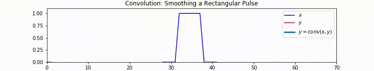

<h4 id="Convolution-Example-2:-ADSR-Envelope">{'Convolution Example 2: ADSR Envelope'}</h4>

```python
x = [1.5] * 10 + [1] * 10 + [0] * 20
h = np.exp(-np.arange(40))
create_convolution_animation(x, h, title='Convolution: ADSR Envelope')
```

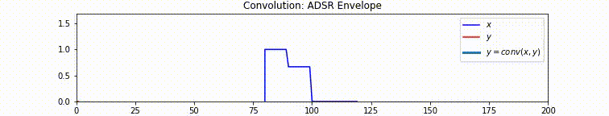

<h4 id="Convolution-Example-3:-Matched-Filtering">{'Convolution Example 3: Matched Filtering'}</h4>

```python
x = [1,1,1,1,0,0,0,0]
h = flip(x)
create_convolution_animation(x, h, title='Convolution: Matched Filtering')
```

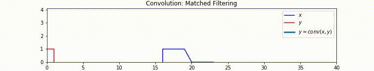

{<p>See my notebook for{" "}<a href="https://colab.research.google.com/github/khiner/notebooks/blob/master/musimathics/volume_2/chapter_4_convolution.ipynb">Musimathics Ch3</a>{" "}for more animated examples of convolution.{" "}

<em>(Note that the definition of convolution in this book is circular, whereas the implementation used in Musimathics is not.
Thus the convolutions do not repeat in the Musimathics animations.{" "}
<strong>Also note</strong> that the non-circular implementation is much more common.
It is what numpy and scipy use, and it is the definition that makes the convolution Fourier theorems below hold.)</em></p>}

<h3 id="Stretch-Operator">{'Stretch Operator'}</h3>

A _stretch by factor $L$_ is defined by

$\\text\{Stretch\}\_\{L,m\}(x) \\triangleq \\begin\{cases\}\\begin\{array\}\{ll\}x(m/L), & m/L \\space\\text\{an integer\}\\\\0, & m/L \\space\\text\{non-integer\}\\end\{array\}\\end\{cases\}$.

```python
def stretch(x, L):
    x = np.asarray(x)
    stretched = np.zeros(L * len(x))
    if x.dtype == complex:
        stretched = stretched.astype(complex)
    for m in range(stretched.size):
        if m % L == 0:
            stretched[m] = x[(m+1) // L]
    return stretched

stretch([4,1,2], 3)
> array([ 4.,  0.,  0.,  1.,  0.,  0.,  2.,  0.,  0.])
```

The stretch operator describes _upsampling_ - increasing the sampling rate by an integer factor.
A stretch by $K$ followed by lowpass filtering to the frequency band $\\omega \\in (-\\pi/K,\\pi/K)$ implements _ideal bandlimited interpolation_.

<h3 id="Zero-Padding">{'Zero Padding'}</h3>

Definition: $\\text\{ZeroPad\}\_\{M,m\}(x) \\triangleq \\begin\{cases\}\\begin\{array\}\{ll\}x(m), & |m| \< N/2 \\space\\text\{an integer\}\\\\0, & \\space\\text\{otherwise\}\\end\{array\}\\end\{cases\}$

```python
def zero_pad(x, M):
    return np.insert(x, (len(x) + 1) // 2, np.zeros(M - len(x)))

zero_pad([1,2,3,4,5], 10)
> array([1, 2, 3, 0, 0, 0, 0, 0, 4, 5])

zero_pad([1,2,3,0,0], 10)
> array([1, 2, 3, 0, 0, 0, 0, 0, 0, 0])
```

<h3 id="Repeat-Operator">{'Repeat Operator'}</h3>

```python
def repeat(x, L):
    return np.hstack([x] * L)

repeat([0,2,1,4,3,1], 2)
```

<h3 id="Down-sampling-Operator">{'Down-sampling Operator'}</h3>

_Down-sampling by $L$_ (also called _decimation_ by $L$) is defined for $x \\in \\mathbb\{C\}^N$ as taking every $L\_\{th\}$ sample, starting with sample zero:

$\\begin\{align\} \\text\{Downsample\}\_\{L,m\}(x) &\\triangleq x(mL),\\\\ m &= 0,1,2,...,M-1\\\\ N &= LM \\end\{align\}$.

```python
def downsample(x, L):
    return x[::L]

downsample(np.arange(10), 2)
> array([0, 2, 4, 6, 8])
```

<h3 id="Alias-Operator">{'Alias Operator'}</h3>

The _aliasing operator_ for $N$-sample signals $x \\in \\mathbb\{C\}^N$ is defined by

$\\begin\{align\} \\text\{Alias\}\_\{L,m\}(x) &\\triangleq \\sum\_\\limits\{l=0\}^\\limits\{L-1\}x(m + lM),\\\\ m &= 0,1,2,...,M-1\\\\ N &= LM \\end\{align\}$.

```python
def alias(x, L):
    x = np.asarray(x)
    M = (x.size + 1) // L
    return x.reshape((L, M)).sum(axis=0)

x = np.arange(6)
alias(x, 2)
> array([3, 5, 7])

alias(x, 3)
> array([6, 9])
```

<h3 id="Fourier-Theorems">{'Fourier Theorems'}</h3>

In the next section, I will show empirically that all of the theorems listed in the book hold.

<h3 id="Linearity">{'Linearity'}</h3>

**Theorem:** For any $x, y \\in \\mathbb\{C\}^N$ and $\\alpha, \\beta \\in \\mathbb\{C\}$, the DFT satisfies

$\\fbox\{$\\alpha x + \\beta y \\longleftrightarrow \\alpha X + \\beta Y$\}$

```python
x = np.cos(np.linspace(-2 * np.pi, 2 * np.pi * 4, 40, endpoint=False))
y = np.sin(np.linspace(-2 * np.pi, 2 * np.pi * 7, 40, endpoint=False))

X = plot_signal_and_fft(x, show=[1,2], signal_label='$x$')
Y = plot_signal_and_fft(y, show=[1,2], signal_label='$y$')

plot_signal_and_fft(2 * x + 3 * y, show=[1,2], signal_label='$2x + 3y$', spectrum_label='$DFT(2x + 3y)$')
plot_signal_and_fft(spectrum=2 * X + 3 * Y, show=[1,2], signal_label='$2x + 3y$', spectrum_label='$2X + 3Y$')
```

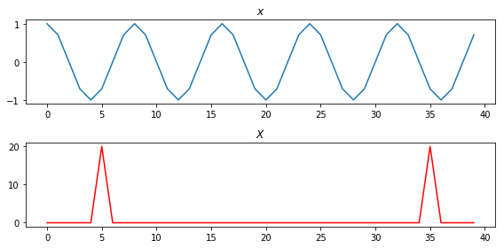

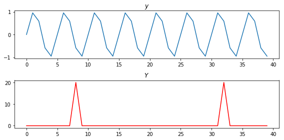

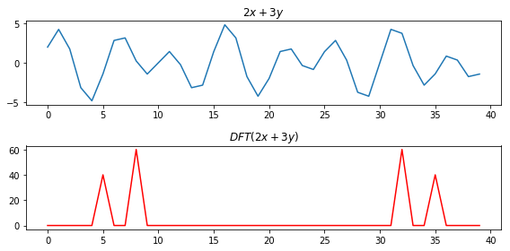

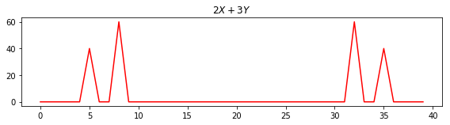

<h3 id="Conjugation-and-Reversal">{'Conjugation and Reversal'}</h3>

**Theorem:** For any $x \\in \\mathbb\{C\}^N$,

$\\fbox\{$\\overline\{x\} \\longleftrightarrow $Flip$(\\overline\{X\})$\}.$

```python
x = np.exp(1j * np.linspace(-2 * np.pi, 2 * np.pi * 4, 40, endpoint=False))

X = plot_signal_and_fft(x, show=[1,2])
plot_signal_and_fft(np.conj(x), show=[1,2], signal_label='$\bar{x}$', spectrum_label='$DFT(\bar{x})$')
plot_signal_and_fft(x, show=[2], spectrum_operator=lambda X: flip(np.conj(X)), spectrum_label='Flip$(\bar{X})$')
```

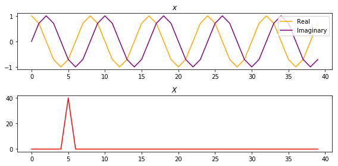

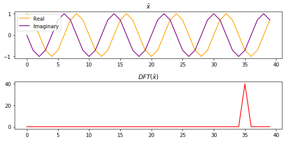

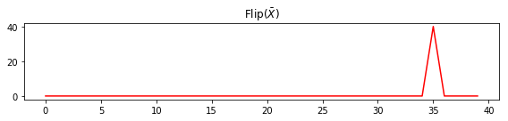

**Theorem:** For any $x \\in \\mathbb\{C\}^N$,

$\\fbox\{Flip$(\\overline\{x\}) \\longleftrightarrow \\overline\{X\}$\}.$

```python
plot_signal_and_fft(flip(np.conj(x)), show=[1,2], signal_label='Flip$(\bar{x})$', spectrum_label='$DFT($Flip$(\bar{x}))$')
plot_signal_and_fft(spectrum=X, show=[2], spectrum_operator=np.conj, spectrum_label='$\bar{X}$')
```

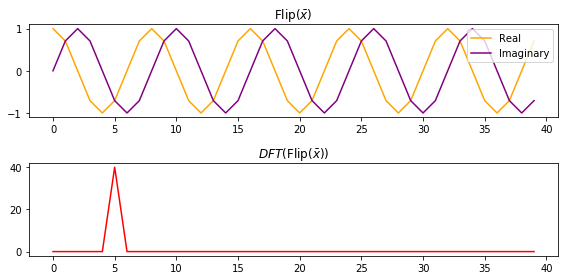

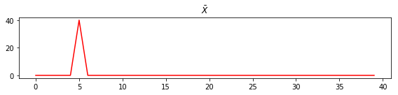

**Theorem:** For any $x \\in \\mathbb\{C\}^N$,

$\\fbox\{Flip$(x) \\longleftrightarrow $ Flip$(\{X\})$\}.$

```python
plot_signal_and_fft(flip(x), show=[1,2], signal_label='Flip$(x)$', spectrum_label='$DFT($Flip$(x))$')
plot_signal_and_fft(spectrum=flip(X), show=[1,2], spectrum_label='Flip$(X)$')
```

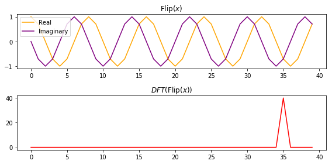

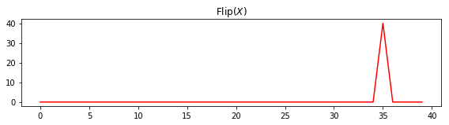

**Corollary:** For any $x \\in \\mathbb\{R\}^N$,

$\\fbox\{Flip$(x) \\longleftrightarrow \\overline\{X\}$\}.$

```python
x = np.sin(np.linspace(-2 * np.pi, 2 * np.pi * 4, 40, endpoint=False))
X = plot_signal_and_fft(x, show=[1,3])
plot_signal_and_fft(flip(x), show=[1,3], signal_label='Flip$(x)$', spectrum_label='$DFT($Flip$(x))$')
plot_signal_and_fft(spectrum=np.conj(X), show=[3], spectrum_label='$\\bar{X}$')
```

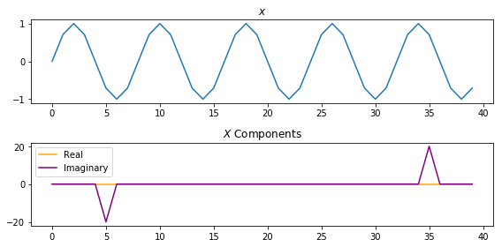

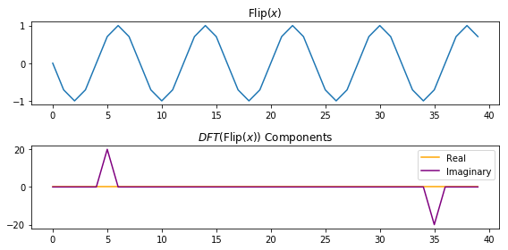


**Corollary:** For any $x \\in \\mathbb\{R\}^N$,

$\\fbox\{Flip$(X) \\longleftrightarrow \\overline\{X\}$\}.$

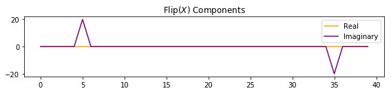

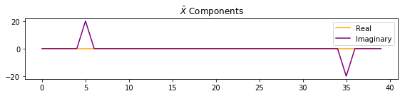

<h3 id="Shift-Theorem">{'Shift Theorem'}</h3>

**Theorem:** For any $x \\in \\mathbb\{C\}^N$ and any integer $\\Delta$,

$\\fbox\{$\\text\{DFT\}\_\{k\}\[\\text\{Shift\}\_\{\\Delta\}(X)\] = e^\{-j\\omega_k\\Delta\}X(k)$\}.$

The shift theorem is often expressed in shorthand as

$\\fbox\{$x(n-\\Delta) \\longleftrightarrow e^\{-j\\omega_k\\Delta\}X(\\omega_k)$\}.$

The shift theorem says that a _delay_ in the time domain corresponds to a _linear phase term_ in the frequency domain.

```python
x = np.exp(1j * np.linspace(0, 2 * np.pi * 6, 40, endpoint=False))

delta = 10
X = plot_signal_and_fft(x)
plot_signal_and_fft(shift(x, delta), signal_label='Shift$_\Delta(x)$', spectrum_label='$DFT($Shift$_\Delta(x))$')
plot_signal_and_fft(spectrum=np.exp(-1j * 2 * np.pi * delta * np.arange(X.size) / X.size) * X, spectrum_label='$e^{-j\omega_k\Delta}X(\omega_k)$')
```

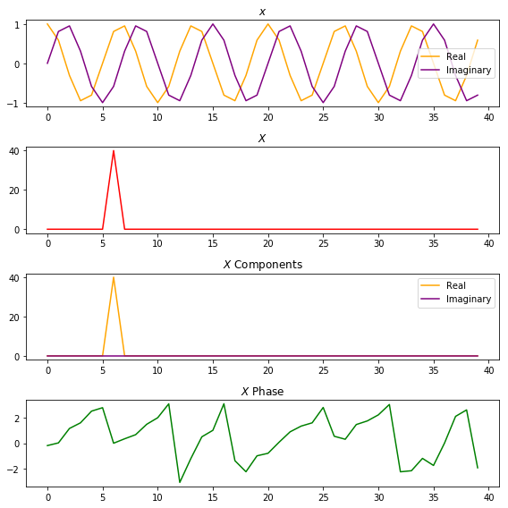

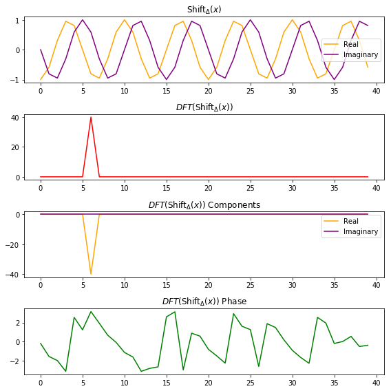

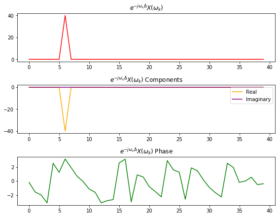

<h3 id="Convolution-Theorem">{'Convolution Theorem'}</h3>

**Theorem:** For any $x,y \\in \\mathbb\{C\}^N$,

$\\fbox\{$x \\circledast y \\longleftrightarrow X \\cdot Y$\}.$

_(Note that we need to zero-pad the signals to the convolution-length before taking their spectra for this to hold, in order to avoid getting spectra corresponding to circular convolution)_.

```python
x = np.exp(1j * np.linspace(0, 2 * np.pi * 20, 128, endpoint=False))
y = np.exp(1j * np.linspace(0, 2 * np.pi * 36, 128, endpoint=False))

conv_size = x.size + y.size - 1
X = plot_signal_and_fft(zero_pad(x, conv_size), show=[1,2])
Y = plot_signal_and_fft(zero_pad(y, conv_size), show=[1,2], signal_label='y')
plot_signal_and_fft(np.convolve(x, y), show=[1,2], signal_label='$conv(x, y)$', spectrum_label='DFT$(conv(x, y))$')
plot_signal_and_fft(spectrum=X * Y, show=[2], spectrum_label='$X \\cdot Y$')
```

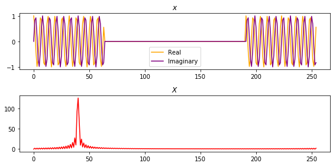

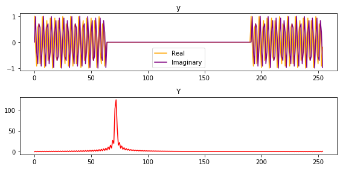

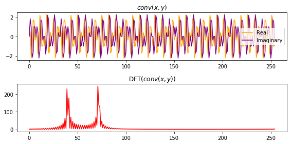

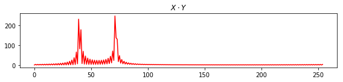

<h3 id="Dual-of-the-Convolution-Theorem">{'Dual of the Convolution Theorem'}</h3>

The dual of the convolution theorem says that _multiplication in the time domain is convolution in the frequency domain_.

**Theorem:**

$\\fbox\{$x \\cdot y \\longleftrightarrow \\frac\{1\}\{N\} X \\circledast Y$\}.$

```python
_ = plot_signal_and_fft(x * y, show=[1,3], signal_label = '$x * y$', spectrum_label='DFT$(x * y)$')
plot_signal_and_fft(spectrum=np.convolve(X, Y)[:x.size] / x.size, show=[3], spectrum_label='$\\frac{1}{N}conv(X, Y)$')
```

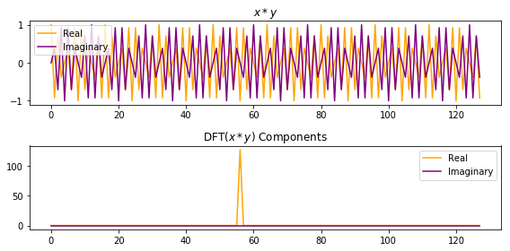

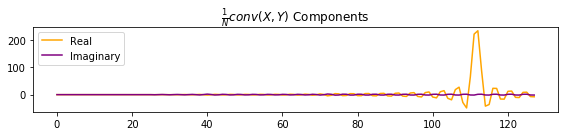

<h3 id="Power-Theorem">{'Power Theorem'}</h3>

**Theorem:** For all $x,y \\in \\mathbb\{C\}^N$,

$\\fbox\{$\\langle x , y \\rangle = \\frac\{1\}\{N\}\\langle X , Y \\rangle$\}.$

```python
x = np.exp(1j * np.arange(100))
y = np.exp(1j * np.arange(100) * 2 * np.pi)
np.abs((x * np.conj(y)).sum())
> 0.54726924741583161

np.abs((np.fft.fft(x) * np.conj(np.fft.fft(y)))).sum() / x.size
> 0.54726924741635341
```

<h3 id="Stretch-Theorem-(Repeat-Theorem)">{'Stretch Theorem (Repeat Theorem)'}</h3>

**Theorem:** For all $x \\in \\mathbb\{C\}^N$,

$\\fbox\{$\\text\{Stretch\}\_L(x) \\longleftrightarrow \\text\{Repeat\}\_L(X)$\}.$

That is, when you stretch a signal by the factor $L$ (inserting zeros between the original samples), its spectrum is repeated $L$ times around the unit circle.

```python
x = np.exp(1j * np.linspace(0, 2 * np.pi * 20, 128, endpoint=False))

L = 3
X = plot_signal_and_fft(x, show=[1,2])
_ = plot_signal_and_fft(stretch(x, L), show=[1,2], signal_label='Stretch$_L(x)$', spectrum_label='DFT(Stretch$_L(x)$)')
_ = plot_signal_and_fft(spectrum=repeat(X, L), show=[1,2], spectrum_label='Repeat$_L(X)$')
```

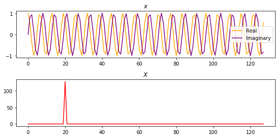

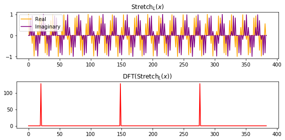

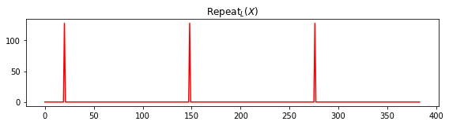

<h3 id="Down-sampling-Theorem-(Aliasing-Theorem)">{'Down-sampling Theorem (Aliasing Theorem)'}</h3>

**Theorem:** For all $x \\in \\mathbb\{C\}^N$,

$\\fbox\{$\\text\{Downsample\}\_L(x) \\longleftrightarrow \\frac\{1\}\{L\}\\text\{Alias\}\_L(X)$\}.$

```python
L = 4
X = plot_signal_and_fft(x, show=[1,2])
plot_signal_and_fft(downsample(x, L), show=[1,2], signal_label='Stretch$_L(x)$)', spectrum_label='DFT(Stretch$_L(x)$)')
plot_signal_and_fft(spectrum=alias(X, L) / L, show=[1,2], spectrum_label='$\\frac{1}{L}$Alias$_L(X)$')
```


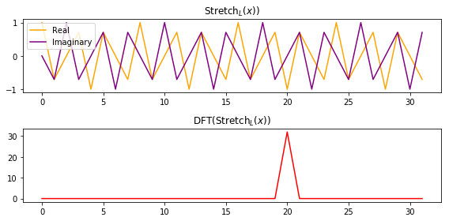

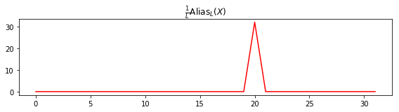

<h3 id="Zero-Padding-Theorem-(Spectral-Interpolation)">{'Zero Padding Theorem (Spectral Interpolation)'}</h3>

Zero padding in the time domain corresponds to _ideal interpolation in the frequency domain_ (for time-limited signals):

**Theorem:** For any $x \\in \\mathbb\{C\}^N$,

$\\fbox\{$\\text\{ZeroPad\}\_\{LN\}(x) \\longleftrightarrow \\text\{Interp\}\_L(X)$\}.$

```python
x = np.exp(1j * np.linspace(0, 2 * np.pi * 4.4, 24, endpoint=False))
X = plot_signal_and_fft(x, show=[1,2])
plot_signal_and_fft(zero_pad(x, 100), show=[1,2], signal_label='ZeroPad$_L(x)$)', spectrum_label='DFT(ZeroPad$_L(x)$)')
```

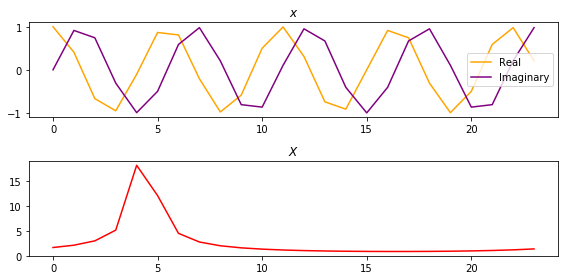

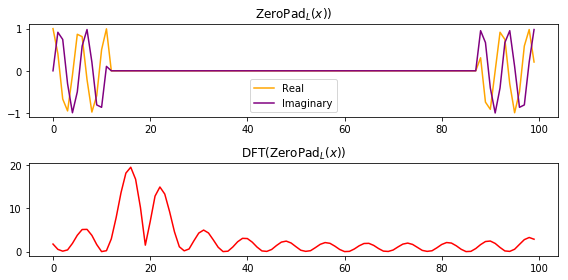

<h3 id="Periodic-Interpolation-(Spectral-Zero-Padding)">{'Periodic Interpolation (Spectral Zero Padding)'}</h3>

The dual of the zero-padding theorem states formally that _zero padding in the frequency domain_ corresponds to _periodic interpolation_ in the time domain:

**Definition:** For all $x \\in \\mathbb\{C\}^N$ and any integer $L \\geq 1$,

$\\fbox\{$\\text\{PerInterp\}(x) \\triangleq \\text\{IDFT\}(\\text\{ZeroPad\}\_\{LN\}(X))$\}.$

```python
x = np.exp(1j * np.linspace(0, 2 * np.pi * 5, 24, endpoint=False))
X = plot_signal_and_fft(x, show=[1,2])

x_interp = np.fft.ifft(zero_pad(X, 100))
plot_signal_and_fft(x_interp, show=[1], signal_label='IDFT(ZeroPad$_{LN}((x))$')
```

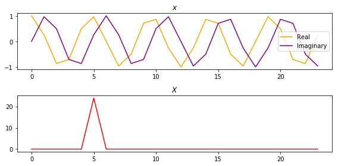

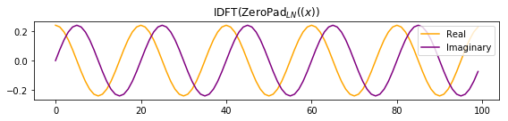

**Definition:** For any $X \\in \\mathbb\{C\}^N$ and any odd integer $M \< N$ we define the _length M even rectangular windowing operation_ by

$\\text\{Chop\}\_\{M,k\}(X) \\triangleq \\begin\{cases\}\\begin\{array\}\{ll\}X(k), & \\space-\\frac\{M-1\}\{2\} \\leq k \\leq \\frac\{M-1\}\{2\}\\\\0, & \\space\\frac\{M+1\}\{2\} \\leq \\left|k\\right| \\leq \\frac\{N\}\{2\}\\end\{array\}\\end\{cases\}$.

**Theorem:** When $x \\in \\mathbb\{C\}^N$ consists of one or more periods from a _periodic_ signal $x^\\prime \\in \\mathbb\{C\}^\\infty$,

$\\fbox\{$\\text\{PerInterp\}\_\{L\}(x) \\longleftrightarrow \\text\{IDFT\}(\\text\{Chop\}\_N(\\text\{DFT\}(\\text\{Stretch\}\_L(x))))$\}.$

```python
def chop(X, M):
    X_chopped = np.zeros(X.size).astype(complex)
    X_chopped[-(M - 1) // 2:] = X[-(M - 1) // 2:]
    X_chopped[:(M - 1) // 2] = X[:(M - 1) // 2]
    return X_chopped

x = np.exp(1j * np.linspace(0, 2 * np.pi * 5, 24, endpoint=False))
X = plot_signal_and_fft(x, show=[1,2])

L = 4
x_stretch = stretch(x, L)
X_stretch = plot_signal_and_fft(x_stretch, show=[1,2], signal_label='Stretch$_L(x)$', spectrum_label='DFT(Stretch$_L(x)$)')

x_interp = np.fft.ifft(chop(X_stretch, x.size))
plot_signal_and_fft(x_interp, show=[1], signal_label='IDFT(Chop$_{N}($DFT$($Stretch$(x))))$')
```


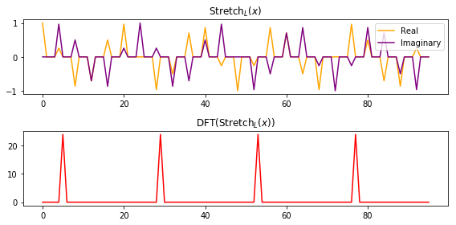

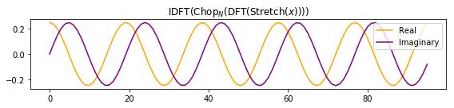

</div>
