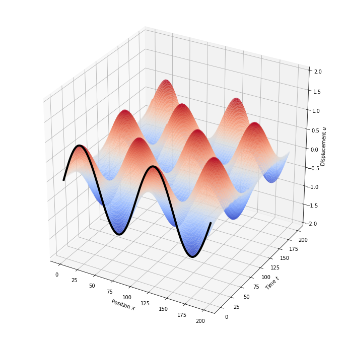
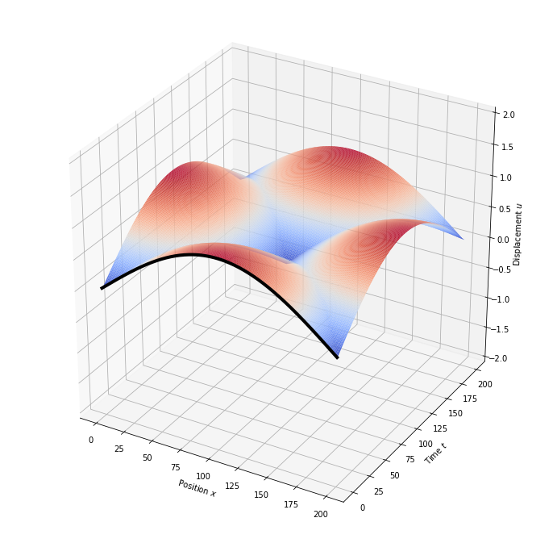
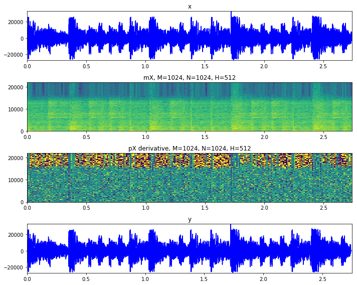

import Audio from '../Audio'

import Video from '../Video'

<div>

{<p><Link href="https://colab.research.google.com/github/khiner/notebooks/blob/master/musimathics/volume_2/index.ipynb">Jupyter notebooks</Link>{" "}<small>(<Link href="https://github.com/khiner/notebooks/tree/master/musimathics/volume_2/">raw Github link</Link>)</small>{" "}for <Link href="http://musimathics.com/">Musimathics Volume 2</Link> are up!
Notebooks for all chapters contain demonstrations and visualizations of some of the topics in the book that caught my interest along the way.</p>}

This second volume builds on the foundations introduced in the first.
It is more dense and technical, and the tools and techniques discussed are more powerful.
While the first volume covers a plethora of diverse audio topics (see [my last post](https://karlhiner.com/jupyter_notebooks/musimathics_volume_1) for an overview), this one is focused on the digital audio domain.
Topics include sampling theory, convolution and spectral audio processing, digital filter design, resonance in physical systems, and sound synthesis techniques.

The author manages to cover a wide range of material without being overly cursory.
He builds up understanding from no assumed background, without underestimating his audience.
Interesting details are explored in depth where appropriate.
I'm using these books to develop intuition before diving into [Julius O. Smith's](https://ccrma.stanford.edu/~jos/pubs.html) DSP books, which are more dense and technical.
I think they've served this purpose well!

In this second volume, I tried a little harder to provide some explanatory context, or to reference the book more explicitly.
These notebooks are still not intended to be a stand-alone educational resource, but I hope they are self-contained enough to be interesting on their own, and helpful as supplemental resources for the topics.

Here is a sample of some of the material in each chapter.
There is much more to explore in the linked notebooks.

### [Chapter 1: Digital Signals and Sampling](https://colab.research.google.com/github/khiner/notebooks/blob/master/musimathics/volume_2/chapter_1_digital_signals_and_sampling.ipynb)

#### Nyquist Sampling Theorem (Aliasing)

Nyquist's theorem states that the apparent frequency $f\_a$ of continuous frequency $f$ sampled at frequency $f\_s$ can be expressed as

$f\_a = f - \\lfloor \\frac\{f\}\{f\_s\} + \\frac\{1\}\{2\} \\rfloor f\_s$.

To see why, consider the following animation, where the cycle on the left is sampled and stored in the cycle on the right.
You can see that the apparent frequency is limited by $\\frac\{+\}\{-\}\\frac\{f\_s\}\{2\}$.
That is, it's limited to $1/2$ of the sampling frequency.

Notice that the times when the apparent frequency is 0 are the times when the orange spinning line on the right appears to change direction from clockwise (negative) to counterclockwise (positive) motion.

```python
def apparent_frequency(f, f_s):
    return (f - np.floor(f / f_s + 0.5) * f_s)
```

<Video src="./assets/musimathics/volume_2/apparent_frequency.mp4" />

There is a meta-sampling thing happening here, too!
Since the blue "continuous" line is sampled at the animation's frame rate of 40 FPS, when the blue line spins at $\\frac\{\\text\{FPS\}\}\{2\} = 20 Hz$ we see a distinct change in direction.
(This crossing point is the horizontal black line in the second chart.)

### [Chapter 2: Musical Signals](https://colab.research.google.com/github/khiner/notebooks/blob/master/musimathics/volume_2/chapter_2_musical_signals.ipynb)

<Video src="./assets/musimathics/volume_2/complex_sinusoid.mp4" />

#### Sum and difference of phasors in conjugate symmetry

Since $e^\{i\\theta\} + e^\{-i\\theta\} = 2\\cos\{\\theta\}$, we also have $\\cos\{\\theta\} = \\frac\{e^\{i\\theta\}\}\{2\} + \\frac\{e^\{-i\\theta\}\}\{2\}$.

Similarly, since $e^\{i\\theta\} - e^\{-i\\theta\} = 2 i \\sin\{\\theta\}$, we can derive $\\sin\{\\theta\} = i(\\frac\{e^\{i\\theta\}\}\{2\} - \\frac\{e^\{-i\\theta\}\}\{2\})$.

One way to interpret this is that _just as a complex phasor contains two sinusoids with $\\frac\{\\pi\}\{2\}$ phase offset, a real sinusoid contains two complex phasors in conjugate symmetry._

<Video src="./assets/musimathics/volume_2/conjugate_symmetry.mp4" />

### [Chapter 3: Spectral Analysis and Synthesis](https://colab.research.google.com/github/khiner/notebooks/blob/master/musimathics/volume_2/chapter_3_spectral_analysis_and_synthesis.ipynb)

#### Constructing a Frequency Detector

A fundamental insight of the Fourier transform is: _The more positive the product signal is, the closer the source signals are to being identical.
The more mixed positive and negative the product signal is, the less identical are the source signals._

<Video src="./assets/musimathics/volume_2/frequency_detector.mp4" />

### [Chapter 4: Convolution](https://colab.research.google.com/github/khiner/notebooks/blob/master/musimathics/volume_2/chapter_4_convolution.ipynb)

The following animations emulate _Figures 4.4-4.9_ on p165-166:

```python
create_convolution_animation(np.ones(10), np.array([1] * 10), normalize=True, title='Convolution of two rectangular windows')
```

<Video src="./assets/musimathics/volume_2/conv_rect_windows.mp4" />

```python
create_convolution_animation(np.array([1] * 19), np.concatenate([np.linspace(0, 0.9, 10), np.linspace(1, 0, 10)]), normalize=True, title='Convolution of window with triangular function')
```

<Video src="./assets/musimathics/volume_2/conv_rect_triangle.mp4" />

```python
create_convolution_animation(np.logspace(1, -1, 20), np.ones(20), normalize=True, title='Convolution of exponential decay with rectangular window')
```

<Video src="./assets/musimathics/volume_2/conv_rect_exp.mp4" />

```python
create_convolution_animation(np.sin(np.linspace(0, 2 * np.pi, 20)), np.sin(np.linspace(0, 2 * np.pi, 20)), normalize=True, title='Convolution of two sine waves')
```

<Video src="./assets/musimathics/volume_2/conv_sines.mp4" />

```python
square_wave = np.concatenate([np.ones(10), np.full(10, -1)])
create_convolution_animation(square_wave, square_wave, 'Convolution of two square waves')
```

<Video src="./assets/musimathics/volume_2/conv_squares.mp4" />

```python
create_convolution_animation(np.logspace(1, -1, 20), np.tile([1,0,], 10), 'Convolution of impulse train with exponential decay')
```

<Video src="./assets/musimathics/volume_2/conv_impulse_exp.mp4" />

### [Chapter 5: Filtering](https://colab.research.google.com/github/khiner/notebooks/blob/master/musimathics/volume_2/chapter_5_filtering.ipynb)

#### Z Transform of the unit Step Function

The "Z transform" of a time domain signal is its complex spectrum defined not just for phasor values along the complex unit circle, but for any complex value $z$.

To understand IIR filter frequency response, we can look at the Z transform of the unit step function:

$u(n) = \\begin\{cases\} 0, & n \< 0.\\\\ 1, & n \\geq 0. \\end\{cases\}$

The unit step function is equivalent to the output of a simple first-order IIR filter with unity gain driven with a single impulse.
Its one-sided Z transform is:

$X(z) = \\sum\_\\limits\{n=0\}^\\limits\{\\infty\}\{1\\cdot z^\{-n\}\} = \\frac\{1\}\{1-z^\{-1\}\}$, $\\left|z\\right| \> 1$.

(The derivation can be found in the book.)

By multiplying the numerator and denominator by $z$, we can write this as

$X(z) = \\frac\{z\}\{z-1\}$, $\\left|z\\right| \> 1$.

```python
def unit_step_z_transform(z):
    return z / (z - 1)
```

The following chart emulates Figure 5.19 in the book:

<Image src="./assets/musimathics/volume_2/unit_step_z_transform_3d.png" style={{ maxWidth: 600 }} />

### [Chapter 6: Resonance](https://colab.research.google.com/github/khiner/notebooks/blob/master/musimathics/volume_2/chapter_6_resonance.ipynb)

#### Damped Harmonic Oscillator

Displacement $x$ of a damped harmonic oscillator:

$x(t) = e^\{\\omega t\} = e^\{-\\frac\{c\}\{2m\}t\}e^\{-\\frac\{\\sqrt\{c^2-4km\}\}\{2m\}t\}$,

where $m$ is mass of the system, $c$ is a constant called the _damping factor_, $k$ is the elastic restoring force constant, or spring constant, $\\omega$ is the angular velocity, and $t$ is time.

Note that in the second term, if $c^2-4km$ is positive, then the second term is real, and so it will not vibrate and sill instead be a simple exponential decay function.
If it is negative, however, the exponent will be imaginary and the second term will be a phasor that vibrates.
The system does not vibrate when dissipation dominates over other forces.

```python
def dho_displacement(m, c, k, t):
    return np.exp(-c*t/(2 * m)) * np.exp(-np.sqrt(c ** 2 - 4 * k * m + 0j) * t / (2 * m)).real
```

<Video src="./assets/musimathics/volume_2/damped_harmonic_oscillator.mp4" />

### [Chapter 7: The Wave Equation](https://colab.research.google.com/github/khiner/notebooks/blob/master/musimathics/volume_2/chapter_6_resonance.ipynb)

#### Modeling Vibration with Finite Difference Equations

We can estimate the displacement $u$ of the point $x\_j$ along a string at time $t\_n$ using the _finite difference approximation of the wave equation_:

$u\_\{n+1,\\space j\} = u\_\{n,\\space j + 1\} + u\_\{n,\\space j - 1\} - u\_\{n - 1,\\space j\}$

```python
def populate_finite_differences_matrix(u, initial_displacements):
    u[0,:] = initial_displacements
    u[1,:] = u[0,:]
    for t in range(2, u.shape[0]):
        u[t,:] = np.roll(u[t - 1,:], 1) + np.roll(u[t - 1,:], -1) - u[t - 2,:]
    return u

    from mpl_toolkits.mplot3d import Axes3D
import matplotlib.pyplot as plt
%matplotlib inline

def plot_finite_differences_matrix(u):
    fig = plt.figure(figsize=(12, 12))
    ax = fig.gca(projection='3d')
    x, y = np.meshgrid(np.arange(u.shape[1]), np.arange(u.shape[0]))
    surf = ax.plot_surface(x, y, u, cmap='coolwarm', antialiased=True, rcount=u.shape[1], ccount=u.shape[0])

    ax.plot(np.arange(u.shape[1]), np.zeros(u.shape[0]), u[0,:], linewidth=4, color='black')
    ax.set_xlabel('Position $x$')
    ax.set_ylabel('Time $t$')
    ax.set_zlabel('Displacement $u$')
    ax.set_zlim(-2, 2)

T = 201
N = 201
u = np.ndarray((T, N))

populate_finite_differences_matrix(u, np.sin(np.linspace(0, 4 * np.pi, u.shape[1])))
plot_finite_differences_matrix(u)
```



```python
populate_finite_differences_matrix(u, np.sin(np.linspace(0, np.pi, u.shape[1])))
plot_finite_differences_matrix(u)
```



### [Chapter 9: Sound Synthesis](https://colab.research.google.com/github/khiner/notebooks/blob/master/musimathics/volume_2/chapter_9_sound_synthesis.ipynb)

#### Geometric Waveforms: Square waves

If we only sum odd-numbered sine-phase harmonics and arrange their ampliltudes to be odd reciprocals,

$f(t) = \\sum\_\\limits\{k=0\}^\\limits\{N-1\}\{\\frac\{1\}\{2k + 1\}\\sin\{\[2\\pi(2k + 1) \\dot t\]\}\}, N \> 0$,

then the series converges as $N \\to \\infty$ to a _square wave._

```python
def square_wave_approx(N, frequency, duration_sec):
    t_range = np.linspace(0, duration_sec, samps(duration_sec))
    return np.sum([(1/k) * np.sin(2 * np.pi * frequency * k * t_range) for k in range(1, 2 * N + 1, 2)], axis=0)

from ipython_animation import create_animation

fig = plt.figure(figsize=(10, 6))
ax, = plt.plot(square_wave_approx(1, 4, 1))
plt.ylim(-1.1, 1.1)
def animate_square_wave_approx(frame):
    ax.set_ydata(square_wave_approx(frame + 1, 4, 1))
    plt.title('Approximation of square wave with %i summed odd-harmonics' % (frame + 1))

create_animation(fig, plt, animate_square_wave_approx, length_seconds=3, frames_per_second=12)
```

<Video src="./assets/musimathics/volume_2/approx_square_with_sines.mp4" />

Note the slight overshoot and ringing at the ends of the vertical excursion of the waveforms.
This effect is called the _Gibbs phenomenon_ (or _Gibbs' horns_).
The Fourier series functions only approximate the discontinuous points of the non-band-limited square wave function.

```python
from scipy.signal import square

def square_wave(amplitude=1, frequency=440, t=0):
    return amplitude * square(2 * np.pi * frequency * seconds(t))

square_tone = [square_wave(frequency=50, t=t) for t in range(samps(0.1))]
plt.plot(square_tone)
_ = plt.title('Geometric square wave')
```

<Image src="./assets/musimathics/volume_2/square_wave.png" style={{ maxWidth: '550px' }} />

Compare the sound of the non-band-limited (geometric) square wave ...

```python
render_samples_ipython([square_wave(env(decay_time_samples=samps(2), t=t), frequency=220, t=t) for t in range(samps(2.2))])
```

<Audio src="./assets/musimathics/volume_2/geometric_square_wave.wav" />

with a square wave estimated with 20 odd-harmonic sinusoids:

```python
swa = square_wave_approx(20, frequency=220, duration_sec=2.2)
render_samples_ipython(np.array([env(decay_time_samples=samps(2), t=t) for t in range(len(swa))]) * swa)
```

<Audio src="./assets/musimathics/volume_2/band_limited_square_wave.wav" />

#### Frequency Modulation

Frequency modulation can be defined mathematically as

$f(t) = A\\sin(\\omega\_c t+ \\Delta f \\sin\{\\omega\_m t\})$,

where $A$ is amplitude, $\\omega\_c = 2\\pi f\_c$ is the carrier frequency, and $\\omega\_m = 2\\pi f\_m$ is the modulating frequency.
The term $\\Delta f$, called _peak frequency deviation_, determines the amplitude of the modulating oscillator's output, which controls the swing of the carrier oscillator's frequency.

The following animation is a reproduction of the series of plots in _Figure 9.29_ on p390.

In the book, the author notes that as $\\Delta f$ grows, the carrier frequency declines in amplitude, and additional sidebands at fixed frequencies $f\_c \\pm nf\_m$ enter the spectrum, where $n$ is the integer order of the sidebands.
However, when $\\Delta f \\approx 3.6$, the carrier frequency makes a reappearance.

The following animation corroborates this observation:

<Video src="./assets/musimathics/volume_2/freq_mod.mp4" />

Let's hear what this sounds like:

```python
t_range = np.linspace(0, 5, samps(5))
peak_frequency_deviation_range = np.linspace(0, 5, samps(5))
tone = np.sin(2 * np.pi * carrier_frequency * t_range + peak_frequency_deviation_range * np.sin(2 * np.pi * modulator_frequency * t_range))

tone[:samps(0.4)] *= np.linspace(0, 1, samps(0.4)) # remove start click
render_samples_ipython(tone)
```

<Audio src="./assets/musimathics/volume_2/freq_mod.wav" />

#### Tapped Delay Line

```python
def tapped_delay_line(x, delay_length, output_length, tap_indices=[0], tap_amps=[0.5], feedback_envelope=None):
    assert feedback_envelope is None or len(feedback_envelope) == output_length
    assert len(tap_indices) == len(tap_amps)

    delay_stack = np.zeros(delay_length)
    output = np.ndarray(output_length)
    for out_i in range(output.size):
        delay_i = out_i % delay_length
        delay_stack[delay_i] *= (0.5 if feedback_envelope is None else feedback_envelope[out_i])
        delay_stack[delay_i] += x[out_i % x.size]
        output[out_i] = np.sum(delay_stack[(delay_i + tap_indices) % delay_length] * tap_amps)

    return output
```

Using 16 random tap indices and amplitudes for the left and right channel separately, it's easy to hear how this general idea could be extended, with a fair amount of art and engineering on the tap indices and amplitudes, along with some artful filtering and stereo field arrangement, to create realistic sounding artificial reverberation!

```python
num_taps = 16
delay_length=samps(0.5)
channels = []
for channel in range(2):
    tap_indices = np.random.randint(0, delay_length, num_taps)
    tap_amps = np.random.rand(num_taps)
    channels.append(tapped_delay_line(samples[channel,:], delay_length=delay_length, output_length=samps(output_time_seconds), tap_indices=tap_indices, tap_amps=tap_amps, feedback_envelope=feedback_envelope))
render_samples_ipython(channels, rate=rate)
```

<Audio src="./assets/musimathics/volume_2/tapped_delay_line.wav" />

#### Karplus-Strong Synthesis

We can create a flexible and very inexpensive physical model of a plucked string out of a delay line.
First, remove the input $x(n)$ from the delay line.
Then preload a sequence of random samples into the memory cells of the delay line.

Then we recirculate the delay line's output back to its input.
The samples in the recirculating delay line form a periodic sample pattern that the ear detects as a complex tone, with a frequency $f$ corresponding to the length of the delay line and the sampling rate, $f = R / L$.
Even though the pattern is random, the ear interprets it as a steady, buzzy timbre.

We can change the feedback parameter to control the decay of the recirculating delay line.

<Audio src="./assets/musimathics/volume_2/karplus_strong.wav" />

### [Chapter 10: Dynamic Spectra](https://colab.research.google.com/github/khiner/notebooks/blob/master/musimathics/volume_2/chapter_10_dynamic_spectra.ipynb)

#### Inverse Short-Time Fourier Transform (ISTFT)

By applying the Inverse Discreet Fourier Transform (IDFT) to each analysis frame and overlapping the analysis windows, we can perfectly reconstruct the original signal.

```python
y = plot_stft_analysis(samples)
```



We can see that original signal and the one reconstructed via a STFT $\\rightarrow$ ISTSF transform look identical.

#### Morphing Spectra with the STFT

Since the STFT is a representation that combines the time and frequency domains, we can use it to directly manipulate the frequency domain over time.

For example, we can morph the spectra of two different signals over time.
In the following example, the sound of an orchestra gradually has its spectrum mixed with the spectrum of a section of male speech.
In this way we can start to mix _timbres_ of sounds, among many other applications.

_(This is taken directly from the [Audio Signal Processing](https://github.com/MTG/sms-tools/blob/master/software/transformations/stftTransformations.py) [course lectures](https://github.com/MTG/sms-tools/blob/master/lectures/08-Sound-transformations/plots-code/stftMorph-orchestra.py))._

<Audio src="./assets/musimathics/volume_2/spectral_morphing.wav" />

{<><br /><br /></>}

I hope you get some use or inspiration out of these notebooks.
Please email or open an issue on GitHub with questions, corrections and comments!

</div>
