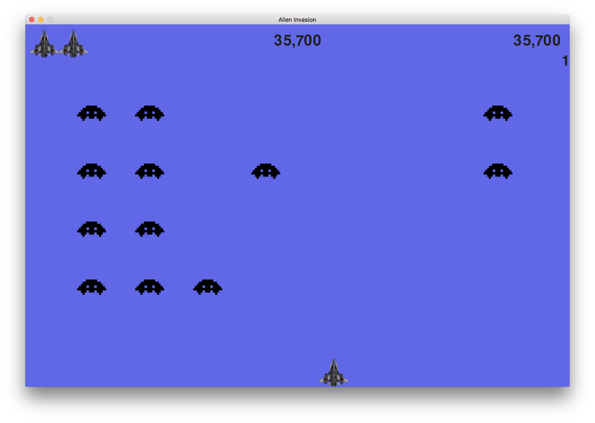
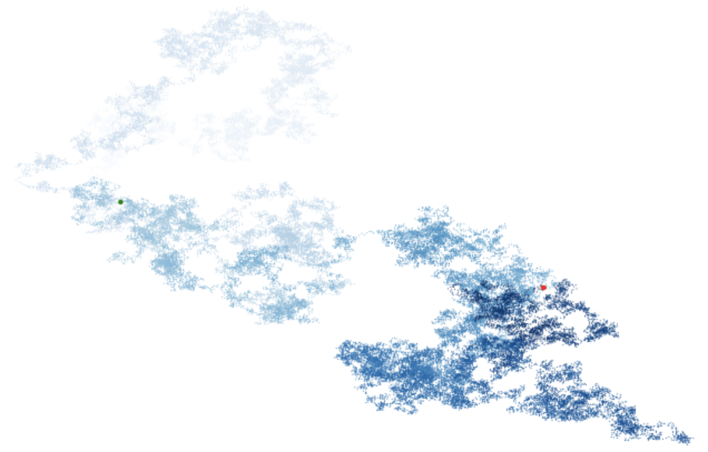
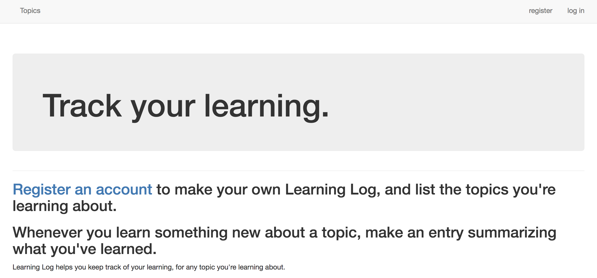

{
<Link href="https://colab.research.google.com/github/khiner/notebooks/blob/master/python_crash_course/index.ipynb"><big>This Jupyter notebook</big></Link>{" "}includes all code, excercises and projects from the{" "}<Link href="https://www.amazon.com/Python-Crash-Course-Hands-Project-Based/dp/1593276036/">Python Crash Course</Link>{" "}book by Eric Matthes.
In addition to a great overview of the important features of the Python language, this book includes three projects: a "Space Invaders"-style game developed with PyGame, a data visualization project and a Django app.{" "}

<Link href="https://github.com/khiner/notebooks/tree/master/python_crash_course">Here is the GitHub</Link>.
}

Here's a screenshot of the Space Invadors-style game ([chapters 12, 13 and 14](https://colab.research.google.com/github/khiner/notebooks/blob/master/python_crash_course/chapters_12_13_and_14.ipynb)):

Here's an image of a gorgeous fading random walk chart generated from 50,000 points with a color gradient, which can be found in [chapter 15](https://colab.research.google.com/github/khiner/notebooks/blob/master/python_crash_course/chapter_15.ipynb):

... and here's a screenshot of the Learning Log project built with Django and deployed with Heroku ([chapters 18, 19 and 20](https://colab.research.google.com/github/khiner/notebooks/blob/master/python_crash_course/chapters_18_19_and_20.ipynb)):

Mine is available for use at [https://learning-log-pcc.herokuapp.com](https://learning-log-pcc.herokuapp.com/) _(although this was just an exercise and I don't promise any functional maintenance if anything's broken!)_

If you end up referring to this notebook while going through the book, or if you've already gone through the excercises yourself and want to chat about them, I'd love to hear from you!

