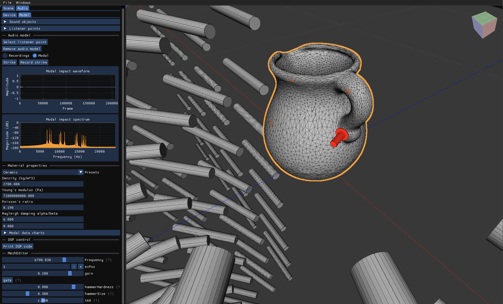

import CeramicKoiBowlMesh from './assets/images/impact/CeramicKoiBowlMesh.png'

import CeramicKoiBowlAudioReal from './assets/audio/impact/CeramicKoiBowlImpact.wav'

import CeramicKoiBowlAudioModal from './assets/audio/impact/CeramicKoiBowlModal.wav'

import CeramicPitcherMesh from './assets/images/impact/CeramicPitcherMesh.png'

import CeramicPitcherAudioReal from './assets/audio/impact/CeramicPitcherImpact.wav'

import CeramicPitcherAudioModal from './assets/audio/impact/CeramicPitcherModal.wav'

import GlassCupMesh from './assets/images/impact/GlassCupMesh.png'

import GlassCupAudioReal from './assets/audio/impact/GlassCupImpact.wav'

import GlassCupAudioModal from './assets/audio/impact/GlassCupModal.wav'

import IronMortarMesh from './assets/images/impact/IronMortarMesh.png'

import IronMortarAudioReal from './assets/audio/impact/IronMortarImpact.wav'

import IronMortarAudioModal from './assets/audio/impact/IronMortarModal.wav'

import IronSkilletMesh from './assets/images/impact/IronSkilletMesh.png'

import IronSkilletAudioReal from './assets/audio/impact/IronSkilletImpact.wav'

import IronSkilletAudioModal from './assets/audio/impact/IronSkilletModal.wav'

import PlasticScoopMesh from './assets/images/impact/PlasticScoopMesh.png'

import PlasticScoopAudioReal from './assets/audio/impact/PlasticScoopImpact.wav'

import PlasticScoopAudioModal from './assets/audio/impact/PlasticScoopModal.wav'

import CeramicSwanSmallMesh from './assets/images/impact/CeramicSwanSmallMesh.png'

import CeramicSwanSmallAudioReal from './assets/audio/impact/CeramicSwanSmallImpact.wav'

import CeramicSwanSmallAudioModal from './assets/audio/impact/CeramicSwanSmallModal.wav'

import SteelStandMesh from './assets/images/impact/SteelStandMesh.png'

import SteelStandAudioReal from './assets/audio/impact/SteelStandImpact.wav'

import SteelStandAudioModal from './assets/audio/impact/SteelStandModal.wav'

import CarillonBellMesh from './assets/images/CarillonBell.png'

import CarillonBellAudio from './assets/audio/CarillonBell.wav'

import ChurchBellMesh from './assets/images/ChurchBell.png'

import ChurchBellAudio from './assets/audio/ChurchBell.wav'

import EnglishBellMesh from './assets/images/EnglishBell.png'

import EnglishBellAudio from './assets/audio/EnglishBell.wav'

import HandDrumMesh from './assets/images/HandDrum.png'

import HandDrumAudio from './assets/audio/HandDrum.wav'

import SteelTeapotMesh from './assets/images/SteelTeapot.png'

import SteelTeapotAudio from './assets/audio/SteelTeapot.wav'

import WineGlassMesh from './assets/images/WineGlass.png'

import WineGlassAudio from './assets/audio/WineGlass.wav'

import ImpactGrid from './ImpactGrid'

[Mesh Audio Editor](https://github.com/khiner/MeshEditor) is a 3D editor supporting conversion of meshes into real-time interactive physical audio models that can be "struck" at any vertex (or excited by an external audio signal).
It is also a [_RealImpact_](https://samuelpclarke.com/realimpact/) dataset explorer - any mesh loaded from the _RealImpact_ dataset supports comparing its model-synthesized impact audio with a real-world recording of the corresponding household object (from which the surface mesh was scanned) being struck at the same vertex.

{
This is a continuation of a prior project,{" "}<Link href="https://github.com/khiner/mesh2audio"><i>Mesh2Audio</i></Link>, which generates Faust DSP code implementing a modal audio model from a given surface mesh and material properties. <i>Mesh2Audio</i> builds on the work of Michon, Martin & Smith in their{" "}<Link href="https://hal.science/hal-03162901/document"><i>Mesh2Faust</i></Link>{" "}project, with the following major contributions:
}

- An OpenGL-based interface for axisymmetric mesh generation, immediate-mode Faust DSP parameter interface, interactive vertex excitation, and more.
- A from-scratch 2D axisymmetric FEM model implementation (by [Ben Wilfong](https://www.cc.gatech.edu/people/benjamin-wilfong)).
- Dramatically speeds up Finite Element and eigenvalue estimation.
- Lots of other improvements, [contributed to the Faust project](https://github.com/grame-cncm/faust/pull/870).

{
<i>Mesh Audio Editor</i> extends <i>Mesh2Audio</i> with the following major improvements and additions (with relevant parts also <Link href="https://github.com/grame-cncm/faust/pull/1019">contributed to Faust</Link>):
}

- A complete rewrite of the interactive application from OpenGL to Vulkan with improved UI and UX.
- A comprehensive integrated RealImpact 3D dataset explorer supporting interactive listener position selection, playback of impact sounds at recorded vertices, and comparison of real-world impact recordings with modal model impacts.
- Add damping to the modal FEM model, resulting in major improvements to physical realism, especially for objects with short resonance durations.
- Extensive improvements and additions to mesh editing and debugging capabilities.
- Ability to create mesh primitives (cube, sphere, torus, cylinder, etc.) and generate modal audio models from them.
- Improvements to eigenvalue estimation accuracy.

For details, see the accompanying [paper](https://github.com/khiner/MeshEditor/blob/main/paper/PAMofPassiveRigidBodies.pdf) and [GitHub project](https://github.com/khiner/MeshEditor).

#### Impact audio experiments

Below are audio examples synthesized by "striking" modal audio models (by injecting a short wideband pulse at the selected vertex) for various meshes, with comparisons to impact recordings of their real-world counterparts being struck at the same position.
The audio recordings and 3D-scanned meshes come from the _RealImpact_ dataset.
Note that _no parameter estimation_ is done here, unlike in some [other](https://www.microsoft.com/en-us/research/publication/sound-synthesis-impact-sounds-video-games/) [works](https://gamma.cs.unc.edu/AUDIO_MATERIAL).
The only inputs are the 3D-scanned mesh and generic material properties, and thus the resulting audio is rarely a very close match with real-world recordings.
However, as this method is highly computationally efficient, and only requires geometry and a material label, it serves as a strong foundation which lends itself to fine-tuning via parameter estimation.
(Since the full audio pipeline is rendered as Faust DSP code, one potential direction is to transpile the generated Faust programs to JAX using the [JAX backend](https://github.com/grame-cncm/faust/commit/44d66aac61b05cb172e101a2b4051e2aa0ea248f) recently contributed by [David Braun](https://dirt.design/portfolio/), and optimize the parameters directly using a perceptual loss.)

<ImpactGrid
  rows={[
    {
      name: 'Ceramic Koi Bowl',
      meshSrc: CeramicKoiBowlMesh,
      realAudio: CeramicKoiBowlAudioReal,
      modalAudio: CeramicKoiBowlAudioModal,
    },
    {
      name: 'Ceramic Pitcher',
      meshSrc: CeramicPitcherMesh,
      realAudio: CeramicPitcherAudioReal,
      modalAudio: CeramicPitcherAudioModal,
    },
    { name: 'Glass Cup', meshSrc: GlassCupMesh, realAudio: GlassCupAudioReal, modalAudio: GlassCupAudioModal },
    {
      name: 'Iron Mortar',
      meshSrc: IronMortarMesh,
      realAudio: IronMortarAudioReal,
      modalAudio: IronMortarAudioModal,
    },
    {
      name: 'Iron Skillet',
      meshSrc: IronSkilletMesh,
      realAudio: IronSkilletAudioReal,
      modalAudio: IronSkilletAudioModal,
    },
    {
      name: 'Steel Stand',
      meshSrc: SteelStandMesh,
      realAudio: SteelStandAudioReal,
      modalAudio: SteelStandAudioModal,
    },
    {
      name: 'Plastic Scoop',
      meshSrc: PlasticScoopMesh,
      realAudio: PlasticScoopAudioReal,
      modalAudio: PlasticScoopAudioModal,
    },
    {
      name: 'Ceramic Swan',
      meshSrc: CeramicSwanSmallMesh,
      realAudio: CeramicSwanSmallAudioReal,
      modalAudio: CeramicSwanSmallAudioModal,
    },
  ]}
/>

Here are some longer audio samples with multiple impacts, interactively striking the shown meshes at different vertices.
These have no real-world recordings to compare against, but demonstrate some of the variety of sounds that can be produced by the models, even with a single mesh.

<ImpactGrid
  rows={[
    { name: 'Carillon Bell', meshSrc: CarillonBellMesh, modalAudio: CarillonBellAudio },
    { name: 'Church Bell', meshSrc: ChurchBellMesh, modalAudio: ChurchBellAudio },
    { name: 'English Bell', meshSrc: EnglishBellMesh, modalAudio: EnglishBellAudio },
    { name: 'Hand Drum', meshSrc: HandDrumMesh, modalAudio: HandDrumAudio },
    { name: 'Steel Teapot', meshSrc: SteelTeapotMesh, modalAudio: SteelTeapotAudio },
    { name: 'Wine Glass', meshSrc: WineGlassMesh, modalAudio: WineGlassAudio },
  ]}
/>

I had a ton of fun with this project, and I'll be continuing work on the Vulkan mesh editor and exploring audio model improvements in the future.
This linear modal analysis/synthesis approach to audio modeling has been well explored in the literature.
The main contribution of this project is to provide an interactive application for integrated generation, editing, debugging, and testing of 3D meshes and audio models.
Overall, I'm happy with the results and it feels like a solid and extensible baseline for further exploration.

