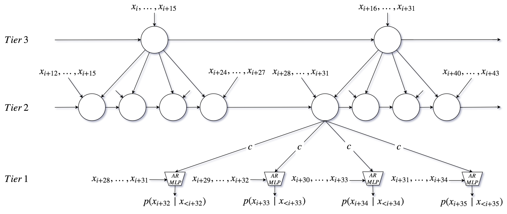

import SoundCloudLink from '../SoundCloudLink'

<div>

Most raw audio generation papers focus on speech.
If musical audio samples are published, they're usually the result of training on simple single-instrument recordings.
My goal with this post is to share some unscientific experiments in training a few popular deep neural network models to generate more complex and musically interesting audio.
I also hope to convey a rough sense of how these tools compare in terms of their generation quality, as well as their training and sampling time.

While there are a ton of papers and resources discussing audio generation models from a theoretical perspective, I haven't found many resources for musicians or enthusiasts who just want to get some musically interesting results.

These models take a lot of time to train, and in some cases take a long time to sample from.
Since I'm running everything locally on a single GPU in my spare time, I haven't done nearly as much experimentation as I'd like.
I've done basically no hyperparameter tuning, using mostly default settings.
In some cases I think more training time or larger datasets could have helped the end result.

As such, the results here don't represent what's _possible_, but rather are just a few data points that should be thought of as baselines.
Some results I think sound great, and some sound bad, noisy, crackly, or just silly.
I think both kinds of results have merit for music production.
"Failure" cases, in addition to sometimes sounding really interesting, can help in gaining some intuition around how these models work from a practical perspective.

## WaveNet

### Model Summary

[WaveNet](https://arxiv.org/abs/1609.03499v2) is without a doubt the most popular deep neural audio generation model.
It's an autoregressive model, meaning that each sample is generated by estimating the most likely value given the past samples.
It's used widely in text-to-speech implementations as a vocoder to translate learned low-dimensional time-frequency representations into natural sounding high-fidelity audio samples.
However, it can be trained and sampled from unconditionally (without any text or linguistic features) to generate audio that sounds similar to the training set.
It can only model dependencies across a finite time context determined by the receptive field of its final layer (read [DeepMind's original blog post](https://deepmind.com/blog/wavenet-generative-model-raw-audio/) for more details).
This finite context means the model can only capture patterns over relatively short timescales (say, around a second).

{<p>For speech generation, this means unconditional sampling generates a kind of incoherent babbling (examples are from DeepMind):<br /><audio src="https://storage.googleapis.com/deepmind-media/pixie/knowing-what-to-say/first-list/speaker-1.wav" controls /><br /></p>}

{<p>For music, the results are only coherent over a few notes, but the timbral characteristics are well modeled:<br /><audio src="https://storage.googleapis.com/deepmind-media/pixie/making-music/sample_2.wav" controls /></p>}

In my experiments, I don't achieve this level of quality.
This is partially because the complexity of the training audio is stretching the limits of the model, and probably to a larger extent due to smaller model sizes, less training time and smaller datasets.

### Results

I trained [this Tensorflow implementation of WaveNet](https://github.com/ibab/tensorflow-wavenet) on the album, ["Dysnomia" by Dawn of Midi](https://youtu.be/zH4lkK-vSco), split into 8 second chunks, converted to mono and downsampled to 16kHz.
All of the code, training data and pretrained models for these results can be found in [this fork](https://github.com/khiner/tensorflow-wavenet).

I trained for the default limit 100k steps, which took about 14 hours on a single 2080 Ti graphics card.
Sampling took about a minute per second of audio.
This first attempt generated the following:

<SoundCloudLink trackId="657682778" />

<SoundCloudLink trackId="657682784" />

Here are the full instructions for setting up, training and generating the above samples:

```shell
$ git clone git@github.com:khiner/tensorflow-wavenet.git
$ cd tensorflow-wavenet
$ conda create -n tensorflow-wavenet python=3.6.8 anaconda
$ conda activate tensorflow-wavenet
$ pip install -r requirements_gpu.txt
$ python train.py --data_dir=datasets/dawn_of_midi
$ python generate.py --wav_out_path=generated/ dom-defaultmodel-100ksteps-640000samples.wav --samples 640000 logdir/train/2019-06-29T08-58-25/model.ckpt-99800
```

I was pleasantly surprised at the quality of this sample!
It's rambly with almost no melodic movement or structure, but rhythmically it has an intuitive, playful free jazz feel.

I also tried training on a different album, ["Give" by The Bad Plus](https://youtu.be/lUCA1w8g8L0), using a similar training procedure.
However, I didn't have as much luck with the results.
Here's an example:

<SoundCloudLink trackId="657682808" />

I noticed in the logs that the code was automatically ignoring a lot of clips since it thought - sometimes incorrectly - they were full of only silence.
I tried again without trimming or ignoring any silence, letting it try to learn the distribution of both low- and high-amplitude audio:

```shell
$ python train.py --data_dir=datasets/bad_plus_give_8s --silence_threshold=0
$ python generate.py --wav_out_path=generated-bad-plus-give-with-silence-64000.wav --samples 64000 logdir/train/2019-07-07T15-54-50/model.ckpt-99950
```

The short result seemed pretty similar:

<SoundCloudLink trackId="657682802" />

Since there's a much wider diversity of sounds in this album, I thought it would help to train for an additional 100k steps:

```shell
$ python train.py --restore_from=logdir/train/2019-07-07T15-54-50/ --data_dir=datasets/bad_plus_give_8s --silence_threshold=0
$ python generate.py --wav_out_path=generated-bad-plus-give-with-silence-200ksteps-64000.wav --samples 64000 logdir/train/2019-07-08T21-30-12/model.ckpt-99900
```

<SoundCloudLink trackId="657682793" />

And here's a longer example (although it's not terribly interesting!)

<SoundCloudLink trackId="657682787" />

It seems to get easily stuck in a single mode with lots of high frequencies that sound like they were learned from the noisy ride and crash cymbals, with a clear kick and snare washed in, but with almost no clearly pitched components.
My intuition is that a lot of the capacity is being allocated to the impossible task of modeling the local distribution of the percussion, which closely approximates white-noise in the case of cymbals (applied generously in the training set).

One thing that has been known to improve generation quality for autoregressive models (introduced by Alex Graves for improved handwriting generation in his paper, [_Generating Sequences with Recurrent Neural Networks_](https://arxiv.org/abs/1308.0850v5)) is to "prime" the generation with a sequence of values from the test distribution.
WaveNet isn't a recurrent network like the ones Graves was working with, but the same principal still works.
It forces the first generated values to be realistic ones, seeding the model so that when it predicts future samples, it is encouraged to continue where the seed left off.
However, given the small receptive field size of the model (about 320ms), and given its clearly poor understanding of the noisy and complex training set, basically all of this influence is lost after generation advances past its receptive field size.
You can hear this in the following seeded clip - the first third of a second (again, the receptive field size) is the seed clip.
In short order it goes right back to being crappy:

<SoundCloudLink trackId="657682796" />

To address this, I followed some advice in [this issue thread](https://github.com/ibab/tensorflow-wavenet/issues/47) and simply increased the receptive field by adding more dilation layers.
Specifically, I settled on a config with a `dilations` argument of:

```json
"dilations": [1, 2, 4, 8, 16, 32, 64, 128, 256, 512, 1014, 2048,
              1, 2, 4, 8, 16, 32, 64, 128, 256, 512, 1024, 2048,
              1, 2, 4, 8, 16, 32, 64, 128, 256, 512, 1024, 2048,
              1, 2, 4, 8, 16, 32, 64, 128, 256, 512, 1024, 2048,
              1, 2, 4, 8, 16, 32, 64, 128, 256, 512, 1024, 2048,
              1, 2, 4, 8, 16, 32, 64]
```

and the rest of the parameters unaltered from the defaults.
This change increases the total receptive field dramatically to about 1.3 seconds.

This is what it came up with (the training and generation commands were identical to the above):

<SoundCloudLink trackId="657682826" />

The results are still pretty cacophonous, but there are some transition points, some brief pauses, and some pitched tones and squeaks!
Also, to my ears, the percussive wash sounds a little more like a jam by Animal from the Muppets, rather than just a continuous swell of textured white noise.
Definitely an improvement.

Training for another 100k steps produced a model with more of an appreciation for space (although about halfway through it remembers how much it loves to just pummel that drum kit):

<SoundCloudLink trackId="657682820" />

And generating with the same model once more makes it clear that this drum sound-wall is still a common mode:

<SoundCloudLink trackId="657682817" />

Overall, I like the results in these last two clips.
There are parts that sound pretty fluid and expressive, with clear individual snare hits, some timbral shifts and satisfying low rumbles.

I also went back and applied this improved model to the Dawn of Midi dataset.
The results are a bit more structured and varied, with more consistency in tempo.
However, they also get stuck in some noisy modes sometimes (exemplified in the last example).
Without further commentary, here are some results:

<SoundCloudLink trackId="657682754" />

<SoundCloudLink trackId="657682742" />

<SoundCloudLink trackId="657682736" />

<SoundCloudLink trackId="657682724" />

## SampleRNN

### Model Summary

[SampleRNN](https://arxiv.org/abs/1612.07837) is another very popular audio generation model.
Unlike WaveNet, SampleRNN is a recurrent model.
Recurrent cells like [LSTMs]() or [GRUs]() can theoretically propagate useful information over arbitrarily long time horizons.
In practice, however, LSTMs usually have a hard time learning latent patterns over long time scales.
In part this is due to issues like vanishing or exploding gradients.
But it is also because of the sheer difficulty of discovering these patterns using a relatively small bank of recurrent memory cells and learned update rules.
The main insight behind SampleRNN is that audio in particular exhibits salient patterns at multiple timescales, and that these patterns and features are composed hierarchically.
For example, timbre is shaped by patterns over very short timescales, while musical events and gestures like bowing or striking an instrument happen over longer timescales.
Melodies are composed of a series of musical events, which are often grouped into compositional structures like bars or phrases, which are further grouped into sections and then full songs.

SampleRNN eases the discovery of these hierarchical timeseries features by imposing a similarly hierarchical network architecture.



RNN memory cells are organized into tiers.
Each cell receives information both from the previous timestep on its own tier, as well as a weighted summary of outputs from a contiguous local group of cells in the previous tier.
This allows each tier to summarize the information in the previous tier at a lower granularity (and thus a higher level of abstraction).

### Results

I trained [this PyTorch implementation of SampleRNN](https://github.com/gcunhase/samplernn-pytorch) on two datasets - the Dysnomia album by Dawn of Midi once again, as well as a piano dataset (4 hours of piano music - the default dataset suggested in the readme).
Again, YouTube audio is split into 8 second chunks, converted to mono and downsampled to 16kHz.
The linked implementation provides a helper script `download-from-youtube.sh`, which is what I used both for SampleRNN and for WaveNet above.
Small modifications (discussed below) and pretrained models can be found in [this fork](https://github.com/khiner/samplernn-pytorch).

Training took about a day on a single 2080 Ti graphics card.
Note that sampling is _faster than realtime_.
This makes it such a cheap operation, relative to training time, that samples are generated by default during training checkpoints.
Here are some curated examples selected from checkpoints on two representative trained models:

<iframe
  title="rnn-playlist-1"
  width="100%"
  height="450"
  allow="autoplay"
  src="https://w.soundcloud.com/player/?url=https%3A//api.soundcloud.com/playlists/825469604&color=%23ff5500&auto_play=false&hide_related=false&show_comments=true&show_user=false&show_reposts=false&show_teaser=false&show_artwork=false"
  style={{ marginBottom: '1em' }}
/>

<iframe
  title="rnn-playlist-2"
  width="100%"
  height="450"
  allow="autoplay"
  src="https://w.soundcloud.com/player/?url=https%3A//api.soundcloud.com/playlists/825451859&color=%23ff5500&auto_play=false&hide_related=false&show_comments=true&show_user=false&show_reposts=false&show_teaser=false&show_artwork=false"
  style={{ marginBottom: '1em' }}
/>

Here are the full instructions for setting up, training and generating the above samples:

```shell
$ git clone git@github.com:khiner/samplernn-pytorch.git
$ cd samplernn-pytorch
$ conda create -n samplernn python=3.6.8 anaconda
$ conda activate samplernn
$ pip install -r requirements.txt
$ pip install youtube-dl
$ ./datasets/download-from-youtube.sh "https://www.youtube.com/watch?v=EhO_MrRfftU" 8 piano
$ python train.py --exp piano --frame_sizes 16 4 --n_rnn 2 --sample_length=160000 --sampling_temperature=0.95 --n_samples=2 --dataset piano
$ ./datasets/download-from-youtube.sh "https://www.youtube.com/watch?v=zH4lkK-vSco" 8 dawn_of_midi
$ python train.py --exp dawn_of_midi --frame_sizes 16 4 --n_rnn 2 --sample_length=160000 --sampling_temperature=0.95 --n_samples=2 --dataset dawn_of_midi
```

The arguments `--sample_length=160000` and `--n_samples=2` tell the trainer to periodically generate and save two 160,000-sample wav files (two 10-second clips of 16kHz audio).

Here are some observations:

<ul>

<li>

All of the clips have a kind of bit-crushed quality, especially during quiet segments.
This makes sense, since the default number of quantization bins, (controlled by the `--q_levels` argument), is 256 (8 bit quantization).
However, all of the WaveNet samples above were also generated with 8 bit quantization, and they don't have nearly as much of that depth-reduction quality to my ears.
One reason for this is likely that SampleRNN uses _linear_ quantization, while WaveNet uses [µ-law](https://en.wikipedia.org/wiki/%CE%9C-law_algorithm) companding quantization, which reduces quantization error in low-amplitude signals.

I tried to address this by increasing the number of quantization bins to 512.
This makes the learning problem more difficult by doubling the number of bins in the final softmax classification layer.
To compensate, I also increased the capacity of the model by increasing the number of RNN layers in each tier (`--n_rnn 3`), and letting it train for about twice as long (a little over two days):

```shell
$ python train.py --exp dawn_of_midi_3_tier --frame_sizes 16 4 --n_rnn 3 --q_levels 512 --sample_length=160000 --sampling_temperature=0.95 --n_samples=2 --dataset dawn_of_midi
```

The results of this experiment aren't really worth sharing as they were similar but with slightly degraded quality.

Further investigation is needed to figure out why this increase in capacity and resolution capability didn't translate to better qualitative results.

</li>

<li>

The overall quality is pretty good!
While the quantization error is more audible than WaveNet, the long-term structure and sample diversity is greatly improved.
The samples have pauses and swells, melodic movement and more restrained rhythms.

This agrees with the impression I've gotten from the [many](https://dadabots.bandcamp.com/) [impressive](https://youtu.be/dTYdRX1b000) [results](https://soundcloud.com/psylent-v/sets/samplernn_iclr2017-tangerine) created by the ML audio community.
SampleRNN has become a go-to model for musicians and coders looking for fresh ways to mash audio data together in fascinating new ways, and some folks are getting much better results than I was able to in these short experiments.

</li>

<li>

Training is generally not stable.
Predictive accuracy improves quickly early on, and quickly flattens out.
Often, after many steps, the accuracy can drop and stay low for long periods, resulting in a consistent run of poor (crackly, noisy) samples.

While I don't have any answers for improving _training_ stability, I found a decent remedy for unstable _generation_.
While looking into different implementations, I saw that this early [Torch port](https://github.com/richardassar/SampleRNN_torch) of the original authors' implementation had a [`sampling_temperature`](https://github.com/richardassar/SampleRNN_torch/blob/master/train.lua#L658) option that allowed for damping the generated samples (at the expense of slightly reduced dynamic range).
I ported this to the PyTorch implementation in [this commit](https://github.com/khiner/samplernn-pytorch/commit/0b8f678c10e0f053a2f205106b371c137f281873), which is the only addition in my fork.
I found that a `sampling_temperature` of around `0.95` basically fixes the problem of runaway high-amplitude sample generation, while also not decaying to silence due to over-damping.

</li>

</ul>

### Toward realtime, controllable audio generation for musicians

Musicians need tools capable of both realtime generation, and realtime control.
There are many fronts converging right now to make that dream possible.

As mentioned above, SampleRNN is capable of faster-than-realtime generation on high-quality GPUs, and there are highly optimized implementations of WaveNet that allow for realtime inference, such as Nvidia's [nv-wavenet](https://github.com/NVIDIA/nv-wavenet).
[GANs are being adapted to the audio domain.](https://arxiv.org/abs/1902.08710v2)
Towards the goal of providing meaningful control, one promising avenue of research is along the lines of [π invertible generative models](https://openai.com/blog/glow/) produce a reversible mapping between latent variables and generated samples.
Nvidia's [WaveGlow](https://nv-adlr.github.io/WaveGlow) model combines these ideas with WaveNet for fast, non-autoregressive conditional audio generation.
[What a time to be alive!](https://paperswithcode.com/task/audio-generation).

</div>
